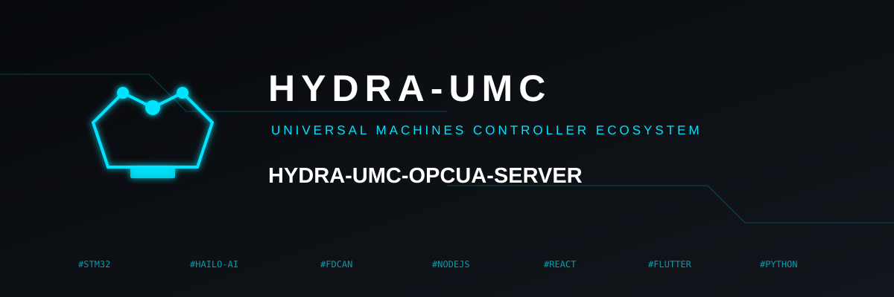

<p align="center">
  
</p>

# 🏭 HYDRA-UMC-OPCUA-SERVER

<p align="center"><a href="README.md">🇺🇸 English</a> | <a href="README_spa.md">🇪🇸 Español</a> | <a href="README_fra.md">🇫🇷 Français</a> | <a href="README_ita.md">🇮🇹 Italiano</a> | 🇩🇪 <b>Deutsch</b> | <a href="README_zho.md">🇨🇳 简体中文</a> | <a href="README_jpn.md">🇯🇵 日本語</a></p>

### 🛠️ Mapping von HydraState-Objekten auf standardisierte OPC-UA-Adressräume

<p align="left">
  
  
  
</p>

---

## 1. 🛠️ TECHNISCHER ÜBERBLICK

**HYDRA-UMC-OPCUA-SERVER** ist das zentrale industrielle Modellierungsmodul für das Gateway. Er übersetzt den internen, dynamischen HydraState (JSON) in einen strukturierten, durchsuchbaren OPC-UA-Adressraum.

Er ermöglicht es industrieller Automatisierungssoftware (wie Ignition, Siemens TIA Portal oder Rockwell FactoryTalk), Robotervariablen zu durchsuchen, zu lesen und zu schreiben, als wären sie Standard-SPS-Tags.

### Hauptmerkmale:
* 🛠️ **Dynamische Informationsmodellierung:** Generiert automatisch den OPC-UA-Baum basierend auf aktiven Robotern und Werkzeugen.
* 🔄 **Lese-/Schreibzugriff:** Sichere Steuerung von Robotergelenken und Effektoren über SPS-Clients.
* 🔖 **Versionierter Namespace & stabile NodeIds:** Eine echte, explizite Namespace-URI und explizite String-NodeIds - eine Aktualisierung des Address Space kann den Pfad, von dem ein Client abhängt, nicht stillschweigend ändern. *(implementiert)*
* 🔐 **Sitzungsbasierte Schreibautorisierung:** Eine echte, dynamische Prüfung, die eine anonyme Sitzung von einer authentifizierten unterscheidet - nicht jeder Client erhält standardmäßig Schreibzugriff. *(implementiert)*
* 📡 **Subscription-Unterstützung:** Hocheffiziente Datenaktualisierungen über OPC-UA-Publish-Subscribe-Mechanismen.
* 🛡️ **Verschlüsselung:** Volle Unterstützung für signierte und verschlüsselte Sicherheitsrichtlinien (Basic256Sha256).

---

## 2. 🔄 OPC-UA-ADRESSRAUM-ABLAUF


---

## 3. 🧱 ARCHITEKTUR & DESIGNENTSCHEIDUNGEN

* **Warum es Geschwister, kein Submodul, von HYDRA-UMC-GATEWAY-INDUSTRIAL ist.** Jeder Protokolladapter ist ein separat bereitstellbarer/neustartbarer Prozess - ein Problem in der OPC-UA-Client-Bibliothek legt nie die daneben laufenden MQTT- oder MTConnect-Adapter lahm.
* **Warum ein OPC-UA-Address-Space statt eines einfachen REST-Passthrough.** OPC-UA-Clients (SCADA/Historians) erwarten einen echten, durchsuchbaren Address Space mit typisierten Knoten - ein flacher REST-Passthrough würde die Daten technisch offenlegen, aber den Sinn ergäbe, überhaupt OPC-UA zu sprechen.
* **Warum der Einstiegspunkt nur Identität/Version ausgibt und nach dem Start eines Health-Check-Listeners beendet wird.** Andamiaje-Stadium, gleicher Grund wie im eigenen README des Elternteils - ein echtes Gateway ist von Natur aus langlaufend, daher ist der Nachweis, dass der Prozess aktiv bleibt, der eigentliche erste Meilenstein.
* **Wie sich das ins restliche Ökosystem einfügt.** Ein Geschwisterdienst unter HYDRA-UMC-GATEWAY-INDUSTRIAL - übersetzt den eigenen Zustand von HYDRA-UMC-SERVER in einen echten OPC-UA-Address-Space.
* **Echte Tests auf Protokollebene, nicht nur eine Kompilierprüfung.** `tests/server.test.ts` verbindet einen echten `OPCUAClient` (der eigene Client von node-opcua, dieselbe Bibliothek, die UAExpert/Ignition verwenden würden) mit einem echten `OPCUAServer` über das echte binäre Protokoll auf einem echten TCP-Port - eine Sitzung wird geöffnet, `SwarmOnline`/`ActiveRobotCount` werden per Pfad durchsucht/gelesen, und es wird bestätigt, dass ein vom Client ausgegebener Schreibvorgang sich sowohl im zurückgelesenen Wert als auch im serverseitigen Zustand widerspiegelt.
* **Warum explizite String-NodeIds statt der automatisch vergebenen numerischen von node-opcua.** Eine numerische NodeId wird nach Erstellungsreihenfolge vergeben - würde man ein neues DataItem im Code vor ein bestehendes einfügen, würde dieses stillschweigend umnummeriert, was jeden industriellen Client bricht, der die alte Nummer fest codiert hat. Eine explizite NodeId im Stil `s=HydraNode_1.SwarmOnline` kann sich niemals unter einem Client verschieben, nur weil sich die Form des Address-Space-Codes geändert hat.
* **Warum `SpindleTemp` `timestamped_get` verwendet, nicht das einfachere `get()`, das die anderen Variablen nutzen.** `get()` versieht jede Lesung automatisch mit dem aktuellen Zeitstempel - passend für einen Live-Wert, unehrlich für einen, der sich langsam ändert (eine Spindel heizt sich zwischen zwei Abfragen nicht neu auf). `timestamped_get` liefert einen echten `DataValue` mit einem expliziten `sourceTimestamp`, der nachverfolgt, wann sich der Wert tatsächlich zuletzt geändert hat - die echte Semantik, auf die sich ein OPC-UA-Historian verlässt.
* **Warum die Schreibautorisierung pro Sitzung erfolgt (`isUserWritable`), statt über ein statisches Zugriffsebenen-Flag.** Ein statisches `userAccessLevel` kann die Sitzung eines Clients nicht von der eines anderen unterscheiden - es ist für jede Verbindung dasselbe. Das Überschreiben von `isUserWritable(context)` am Variablenknoten ist node-opcuas eigener dokumentierter Mechanismus für eine Prüfung, die tatsächlich pro Sitzung variiert - real genug, um es mit zwei verschiedenen echten Client-Identitäten zu testen.

---

## 📂 VERZEICHNISSTRUKTUR

```text
HYDRA-UMC-OPCUA-SERVER/
├── src/         # Quellcode (Node/TypeScript - Modell, Server, Mapper)
├── docs/        # Dokumentation und Tag-Mapping-Referenz
├── build/       # Kompilierte Ausgabe (npm run build)
├── images/      # Medien und Diagramme
├── scripts/     # Utility-Skripte (bump-version.mjs)
└── README.md
```

Reiner Netzwerkdienst ohne eigene Hardware - `hardware/`, `firmware/` und
`os/` werden gemäß der Repository-Strukturpolitik ausgelassen.

---

## 🛠️ ENTWICKLUNGSUMGEBUNG

### Voraussetzungen
- [Node.js](https://nodejs.org/) (v18 oder höher empfohlen)
- npm

### Installation
```bash
npm install
```

### Entwicklungsmodus
Startet den OPC-UA-Server direkt mit `tsx` (ohne Bundler):
- **Windows:** Doppelklick auf `dev.bat` oder `npm run dev` ausführen
- **Linux/Mac:** `./dev.sh` oder `npm run dev` ausführen

### Produktions-Build
Bündelt den Server mit esbuild in eine einzige einsetzbare Datei:
- **Windows:** Doppelklick auf `build.bat` oder `npm run build` ausführen
- **Linux/Mac:** `./build.sh` oder `npm run build` ausführen

Dann starten mit:
```bash
npm start
```

Der Server lauscht auf `0.0.0.0:4840` (der von der IANA registrierte
OPC-UA-Standardport) unter dem Endpoint
`opc.tcp://<host>:4840/HYDRA-UMC-OPCUA-SERVER` - jeden OPC-UA-Client
(UAExpert, Ignition, Siemens TIA Portal, ...) darauf richten, um den
Adressraum zu durchsuchen.

### Versionierung
Jeder echte `npm run build` erhöht automatisch die `version` in
`package.json` (`scripts/bump-version.mjs`, erster Schritt des
`build`-Skripts) - ein "Kilometerzähler" auf Basis 10: patch +1 pro Build,
mit Übertrag auf minor (und von minor auf major) über 9 hinaus, anstatt
je ein zweistelliges Segment zu erreichen (`0.0.9` -> `0.1.0`, nicht
`0.0.10`).

---

## 🚀 FAHRPLAN
* **Phase 1:** OPC-UA Pub/Sub-Implementierung für Hochgeschwindigkeitsdatenaustausch und Legacy-Protokoll-Bridging.
* **Phase 2:** MQTT-Broker-Cluster für massives IoT-Gerätemanagement und hohe Parallelität.
* **Phase 3:** MTConnect-Adapterunterstützung für die Integration von CNC- und SPS-Maschinen verschiedener Hersteller.
* **Phase 4:** Volle Konformität mit der OPC UA Robotics Companion Specification und Synchronisation des Industrielles Gateways.

---

## 🔗 Verwandte Projekte

Dieses Projekt ist Teil eines größeren Robotik-Ökosystems desselben Autors (JuanenRac / Electro Hobby 3D), das Firmware, Steuerungssoftware, KI-Knoten und Flotten-Tools umfasst. Gut zu wissen, denn eine Anfrage könnte tatsächlich eines dieser Projekte betreffen statt dieses Repository.

### Familie

**Elternteil:** **[HYDRA-UMC-GATEWAY-INDUSTRIAL](https://github.com/JuanenRac/HYDRA-UMC-GATEWAY-INDUSTRIAL)** — der Integrations-Elternteil, an den dieser OPC-UA-Adapter andockt.

**Geschwister:**
- **[HYDRA-UMC-MQTT-BROKER](https://github.com/JuanenRac/HYDRA-UMC-MQTT-BROKER)** — Geschwister-Protokolladapter, gleicher Elternteil.
- **[HYDRA-UMC-MTCONNECT-ADAPTER](https://github.com/JuanenRac/HYDRA-UMC-MTCONNECT-ADAPTER)** — Geschwister-Protokolladapter, gleicher Elternteil.

### Direkte Beziehung (außerhalb der Familie)

- **[HYDRA-UMC-SERVER](https://github.com/JuanenRac/HYDRA-UMC-SERVER)** — die Quelle des von diesem Adapter bereitgestellten Zustands.

### Restliches Ökosystem

**HYDRA-UMC-Plattform** — die Multi-Roboter-Mikrofabrikzelle
- **[HYDRA-UMC](https://github.com/JuanenRac/HYDRA-UMC)** — das CM5 + STM32H745-Motherboard, das bis zu 8 Roboterarme orchestriert.
- **[HYDRA-UMC-SERVER](https://github.com/JuanenRac/HYDRA-UMC-SERVER)** — das Express/WebSocket-Backend, mit dem jeder Steuerungsclient spricht.
- **[HYDRA-UMC-STUDIO](https://github.com/JuanenRac/HYDRA-UMC-STUDIO)** — webbasiertes Steuerungs-Dashboard, Multi-Roboter-3D-Visualisierung.
- **[HYDRA-UMC-ANDROID-CONTROL](https://github.com/JuanenRac/HYDRA-UMC-ANDROID-CONTROL)** — Android-Steuerungs-App über Wi-Fi/Bluetooth.
- **[HYDRA-UMC-IOS-CONTROL](https://github.com/JuanenRac/HYDRA-UMC-IOS-CONTROL)** — iOS/iPadOS-Steuerungs-App, gebaut in Flutter.
- **[HYDRA-UMC-SUITE](https://github.com/JuanenRac/HYDRA-UMC-SUITE)** — Desktop-Schwarm-Kommandozentrale (Python/PySide6).
- **[HYDRA-UMC-EDITOR-URDF](https://github.com/JuanenRac/HYDRA-UMC-EDITOR-URDF)** — Desktop-URDF-Modelleditor für den Roboterkatalog.
- **[HYDRA-UMC-DSI](https://github.com/JuanenRac/HYDRA-UMC-DSI)** — native Touch-UI für den eingebauten DSI-Touchscreen.

**URTC-Plattform** — der Werkzeugkopf-Controller, den jeder HYDRA-UMC-Roboterarm trägt
- **[URTC](https://github.com/JuanenRac/URTC)** — CAN-Bus-Werkzeugkopf-Controller, 25 Werkzeugprofile.
- **[URTC-FLASHER](https://github.com/JuanenRac/URTC-FLASHER)** — Desktop-Tool für CAN-OTA + SWD/JTAG-Flashing.
- **[URTC-TESTER](https://github.com/JuanenRac/URTC-TESTER)** — Desktop-Tool für Live-CAN-Bus-Diagnose.
- **[URTC-WEB-STUDIO](https://github.com/JuanenRac/URTC-WEB-STUDIO)** — browserbasierte Alternative über die Web-Serial-API.

**🎥 Vision-KI-Knoten (Hailo-8)**
- [HYDRA-UMC-VISION-NODE](https://github.com/JuanenRac/HYDRA-UMC-VISION-NODE)
- [HYDRA-UMC-VISION-STREAMER](https://github.com/JuanenRac/HYDRA-UMC-VISION-STREAMER)
- [HYDRA-UMC-DETECTION-HEF](https://github.com/JuanenRac/HYDRA-UMC-DETECTION-HEF)
- [HYDRA-UMC-SAFETY-ZONES](https://github.com/JuanenRac/HYDRA-UMC-SAFETY-ZONES)
- [HYDRA-UMC-VISUAL-SERVOING-API](https://github.com/JuanenRac/HYDRA-UMC-VISUAL-SERVOING-API)

**🧠 Kognitiver KI-Knoten (Hailo-10)**
- [HYDRA-UMC-COGNITIVE-NODE](https://github.com/JuanenRac/HYDRA-UMC-COGNITIVE-NODE)
- [HYDRA-UMC-VLA-ENGINE](https://github.com/JuanenRac/HYDRA-UMC-VLA-ENGINE)
- [HYDRA-UMC-VOICE-UI](https://github.com/JuanenRac/HYDRA-UMC-VOICE-UI)
- [HYDRA-UMC-SEMANTIC-PLANNER](https://github.com/JuanenRac/HYDRA-UMC-SEMANTIC-PLANNER)
- [HYDRA-UMC-DOCS-QA](https://github.com/JuanenRac/HYDRA-UMC-DOCS-QA)

**🐝 Orchestrierung & Schwarm**
- [HYDRA-UMC-ORCHESTRATOR](https://github.com/JuanenRac/HYDRA-UMC-ORCHESTRATOR)
- [HYDRA-UMC-SWARM-SYNC](https://github.com/JuanenRac/HYDRA-UMC-SWARM-SYNC)
- [HYDRA-UMC-PATH-PLANNER-3D](https://github.com/JuanenRac/HYDRA-UMC-PATH-PLANNER-3D)
- [HYDRA-UMC-JOB-DISPATCHER](https://github.com/JuanenRac/HYDRA-UMC-JOB-DISPATCHER)
- [HYDRA-UMC-NODE-HEALING](https://github.com/JuanenRac/HYDRA-UMC-NODE-HEALING)

**🎮 Digitaler Zwilling & Simulation**
- [HYDRA-UMC-TWIN](https://github.com/JuanenRac/HYDRA-UMC-TWIN)
- [HYDRA-UMC-PHYSICS-REPLICA](https://github.com/JuanenRac/HYDRA-UMC-PHYSICS-REPLICA)
- [HYDRA-UMC-HIL-BRIDGE](https://github.com/JuanenRac/HYDRA-UMC-HIL-BRIDGE)
- [HYDRA-UMC-SYNTHETIC-DATA-GEN](https://github.com/JuanenRac/HYDRA-UMC-SYNTHETIC-DATA-GEN)

**📊 Daten & Analytik**
- [HYDRA-UMC-DATALAKE](https://github.com/JuanenRac/HYDRA-UMC-DATALAKE)
- [HYDRA-UMC-TELEMETRY-COLLECTOR](https://github.com/JuanenRac/HYDRA-UMC-TELEMETRY-COLLECTOR)
- [HYDRA-UMC-ANOMALY-DETECTOR](https://github.com/JuanenRac/HYDRA-UMC-ANOMALY-DETECTOR)
- [HYDRA-UMC-PRODUCTION-REPORTS](https://github.com/JuanenRac/HYDRA-UMC-PRODUCTION-REPORTS)

**🛠️ Ergänzende Werkzeuge**
- [URTC-SMART-RACK](https://github.com/JuanenRac/URTC-SMART-RACK)
- [URTC-VISION-TOOL](https://github.com/JuanenRac/URTC-VISION-TOOL)
- [HYDRA-UMC-WATCH](https://github.com/JuanenRac/HYDRA-UMC-WATCH)
- [HYDRA-UMC-TOOL-CLI](https://github.com/JuanenRac/HYDRA-UMC-TOOL-CLI)
- [HYDRA-UMC-DASHBOARD-AI](https://github.com/JuanenRac/HYDRA-UMC-DASHBOARD-AI)


## 👤 AUTOR
**JuanenRac** (Electro Hobby 3D)
📧 electrohobby3d@gmail.com

## 📜 LIZENZ
GPL-3.0 - Siehe LICENSE für Details.
