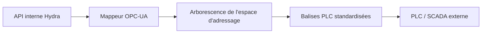

<p align="center">
  
</p>

# 🏭 HYDRA-UMC-OPCUA-SERVER

<p align="center"><a href="README.md">🇺🇸 English</a> | <a href="README_spa.md">🇪🇸 Español</a> | 🇫🇷 <b>Français</b> | <a href="README_ita.md">🇮🇹 Italiano</a> | <a href="README_deu.md">🇩🇪 Deutsch</a> | <a href="README_zho.md">🇨🇳 简体中文</a> | <a href="README_jpn.md">🇯🇵 日本語</a></p>

### 🛠️ Mappage des objets HydraState vers des espaces d'adressage OPC-UA standardisés

<p align="left">
  
  
  
</p>

---

## 1. 🛠️ APERÇU TECHNIQUE

**HYDRA-UMC-OPCUA-SERVER** est le module de modélisation industrielle central de la passerelle (Gateway). Il traduit l'HydraState interne et dynamique (JSON) en un espace d'adressage OPC-UA structuré et découvrable.

Il permet aux logiciels d'automatisation industrielle (comme Ignition, Siemens TIA Portal ou Rockwell FactoryTalk) de parcourir, lire et écrire dans les variables robotiques comme s'il s'agissait de balises (tags) PLC standard.

### Caractéristiques principales :
* 🛠️ **Modélisation dynamique des informations :** Génère automatiquement l'arborescence OPC-UA en fonction des robots et des outils actifs.
* 🔄 **Accès en lecture/écriture :** Contrôle sécurisé des articulations et des effecteurs robotiques à partir des clients PLC.
* 🔖 **Espace de noms versionné & NodeIds stables :** Une URI d'espace de noms réelle et explicite, ainsi que des NodeIds de type chaîne explicites - une mise à jour de l'espace d'adressage ne peut pas changer silencieusement le chemin dont dépend un client. *(implémenté)*
* 🔐 **Autorisation d'écriture par session :** Une vérification réelle et dynamique distinguant une session anonyme d'une session authentifiée - tous les clients n'obtiennent pas un accès en écriture par défaut. *(implémenté)*
* 📡 **Prise en charge des abonnements :** Mises à jour des données haute efficacité à l'aide des mécanismes de publication-abonnement OPC-UA.
* 🛡️ **Cryptage :** Prise en charge complète des politiques de sécurité signées et cryptées (Basic256Sha256).

---

## 2. 🔄 FLUX D'ESPACE D'ADRESSAGE OPC-UA



---

## 3. 🧱 ARCHITECTURE & DÉCISIONS DE CONCEPTION

* **Pourquoi c'est un frère, pas un sous-module, de HYDRA-UMC-GATEWAY-INDUSTRIAL.** Chaque adaptateur de protocole est un processus déployable/redémarrable séparément - un problème dans la bibliothèque cliente OPC-UA ne fait jamais tomber les adaptateurs MQTT ou MTConnect qui tournent à côté.
* **Pourquoi un espace d'adressage OPC-UA, pas un simple passthrough REST.** Les clients OPC-UA (SCADA/historiens) attendent un vrai espace d'adressage navigable avec des nœuds typés - un passthrough REST plat exposerait techniquement les données mais viderait de son sens le fait de parler OPC-UA.
* **Pourquoi le point d'entrée n'imprime qu'identité/version, et se termine après la mise en place d'un listener de health-check.** Étape d'andamiaje, même raison que le propre README du parent - une vraie passerelle est de longue durée par nature, donc prouver que le processus reste actif est le vrai premier jalon.
* **Comment cela s'intègre dans le reste de l'écosystème.** Un service frère sous HYDRA-UMC-GATEWAY-INDUSTRIAL - traduit le propre état de HYDRA-UMC-SERVER en un vrai espace d'adressage OPC-UA.
* **Des tests réels au niveau du protocole, pas seulement une vérification de compilation.** `tests/server.test.ts` connecte un vrai `OPCUAClient` (le client propre de node-opcua, la même bibliothèque qu'utiliseraient UAExpert/Ignition) à un vrai `OPCUAServer` via le vrai protocole binaire sur un vrai port TCP - ouverture d'une session, parcours/lecture de `SwarmOnline`/`ActiveRobotCount` par chemin, et confirmation qu'une écriture émise par le client se reflète à la fois dans la valeur relue et dans l'état interne du serveur.
* **Pourquoi des NodeIds de type chaîne explicites, et non les NodeIds numériques auto-assignés de node-opcua.** Un NodeId numérique est attribué selon l'ordre de création - insérer un nouveau DataItem avant un DataItem existant dans le code le renumérote silencieusement, cassant tout client industriel ayant codé en dur l'ancien numéro. Un NodeId explicite au format `s=HydraNode_1.SwarmOnline` ne peut jamais se déplacer sous un client simplement parce que le code de l'espace d'adressage a changé de forme.
* **Pourquoi `SpindleTemp` utilise `timestamped_get`, et non le `get()` plus simple utilisé par les autres variables.** `get()` horodate automatiquement chaque lecture avec l'heure actuelle - adapté à une valeur en direct, malhonnête pour une valeur qui évolue lentement (une broche ne se réchauffe pas entre deux interrogations). `timestamped_get` renvoie un vrai `DataValue` avec un `sourceTimestamp` explicite qui suit le moment où la valeur a réellement changé pour la dernière fois, la sémantique réelle sur laquelle s'appuie un historien OPC-UA.
* **Pourquoi l'autorisation d'écriture est par session (`isUserWritable`), et non un indicateur statique de niveau d'accès.** Un `userAccessLevel` statique ne peut pas distinguer la session d'un client de celle d'un autre - il est identique pour chaque connexion. Surcharger `isUserWritable(context)` sur le nœud variable est le mécanisme propre et documenté de node-opcua pour une vérification qui varie réellement par session, assez réelle pour être testée avec deux identités de client réelles différentes.

Voir `mejoras_futuras.txt` pour la liste honnête de ce qui est délibérément reporté et pourquoi (l'arbre dynamique par robot, la couverture de test réelle pour le chiffrement/les abonnements, et le point Pub/Sub de la feuille de route).

---

## 📂 STRUCTURE DES RÉPERTOIRES

```text
HYDRA-UMC-OPCUA-SERVER/
├── src/         # Code source (Node/TypeScript - Modèle, Serveur, Mappeur)
├── tests/       # Suite Vitest - comportement serveur et sécurité
├── build/       # Sortie compilée (npm run build)
├── images/      # Médias et diagrammes
├── scripts/     # Scripts utilitaires (bump-version.mjs)
├── tools/       # ci_validate.py - validation manifest/CHANGELOG/docs utilisée par la CI
└── README.md
```

Service réseau pur, sans matériel propre - `hardware/`, `firmware/` et
`os/` sont omis conformément à la politique de structure du dépôt.

---

## 🛠️ ENVIRONNEMENT DE DÉVELOPPEMENT

### Prérequis
- [Node.js](https://nodejs.org/) (v18 ou supérieur recommandé)
- npm

### Installation
```bash
npm install
```

### Mode Développement
Exécute le serveur OPC-UA directement avec `tsx` (sans bundler) :
- **Windows :** double-cliquer sur `dev.bat` ou exécuter `npm run dev`
- **Linux/Mac :** exécuter `./dev.sh` ou `npm run dev`

### Build de Production
Regroupe le serveur en un seul fichier déployable avec esbuild :
- **Windows :** double-cliquer sur `build.bat` ou exécuter `npm run build`
- **Linux/Mac :** exécuter `./build.sh` ou `npm run build`

Puis démarrez-le avec :
```bash
npm start
```

Le serveur écoute sur `0.0.0.0:4840` (le port OPC-UA par défaut enregistré
par l'IANA) à l'endpoint `opc.tcp://<host>:4840/HYDRA-UMC-OPCUA-SERVER` -
pointez n'importe quel client OPC-UA (UAExpert, Ignition, Siemens TIA
Portal, ...) pour parcourir l'espace d'adressage.

### Gestion des versions
Chaque `npm run build` réel incrémente automatiquement le `version` de
`package.json` (`scripts/bump-version.mjs`, première étape du script
`build`) - un « compteur kilométrique » en base 10 : patch +1 par build,
avec report vers minor (et de minor vers major) au-delà de 9 plutôt que
d'atteindre un segment à deux chiffres (`0.0.9` -> `0.1.0`, pas `0.0.10`).

---

## 🚀 FEUILLE DE ROUTE
* **Phase 1 :** Implémentation d'OPC-UA Pub/Sub pour l'échange de données à haute vitesse et le pontage des protocoles hérités.
* **Phase 2 :** Cluster de brokers MQTT pour la gestion massive des appareils IoT et une haute simultanéité.
* **Phase 3 :** Prise en charge de l''adaptateur MTConnect pour l'intégration de machines CNC et d'automates multi-fournisseurs.
* **Phase 4 :** Conformité totale avec la spécification compagnon OPC UA Robotics et synchronisation de la passerelle industrielle.

---

## 🔗 Projets Liés

Ce projet fait partie de l'écosystème robotique HYDRA-UMC du même auteur (JuanenRac / Electro Hobby 3D). Bon à savoir, car une demande pourrait en réalité concerner l'un de ceux-ci plutôt que ce dépôt.

**Projet Parent**
- **[HYDRA-UMC-GATEWAY-INDUSTRIAL](https://github.com/JuanenRac/HYDRA-UMC-GATEWAY-INDUSTRIAL)** — hub d'intégration relayant vers les protocoles industriels, avec une vraie couche de liste blanche de commandes/contre-pression ; le parent dont ce dépôt est un adaptateur de protocole spécifique, au sein de sa propre passerelle industrielle.

**Projets Frères** — les autres adaptateurs de protocole de la propre passerelle industrielle de HYDRA-UMC-GATEWAY-INDUSTRIAL
- **[HYDRA-UMC-MQTT-BROKER](https://github.com/JuanenRac/HYDRA-UMC-MQTT-BROKER)** — vrai broker MQTT avec authentification par client optionnelle et ACL de sujets.
- **[HYDRA-UMC-MTCONNECT-ADAPTER](https://github.com/JuanenRac/HYDRA-UMC-MTCONNECT-ADAPTER)** — vrais points de terminaison XML MTConnect `/probe` et `/current`, avec sortie en mode dégradé.

**Directement Liés**
- **[HYDRA-UMC-SERVER](https://github.com/JuanenRac/HYDRA-UMC-SERVER)** — le vrai backend headless (REST/WebSocket) auquel parle réellement chaque client de contrôle — la source de l'état que cet adaptateur expose.

**Fait Également Partie de l'Écosystème**

*Matériel & Plateforme de Base*
- **[HYDRA-UMC](https://github.com/JuanenRac/HYDRA-UMC)** — la carte mère physique du bras robotique : hôte CM5 + coprocesseur STM32H745 double cœur, coordonnant jusqu'à 8 bras-outils via CAN-OTA/SPI-OTA.
- **[HYDRA-UMC-OS](https://github.com/JuanenRac/HYDRA-UMC-OS)** — couche produit reproductible sur Raspberry Pi OS pour le CM5 : agent en lecture seule, config/profils validés, provisionnement WiFi de premier contact.
- **[HYDRA-UMC-SDK](https://github.com/JuanenRac/HYDRA-UMC-SDK)** — le contrat JSON-Schema partagé et la barrière de sécurité contre laquelle chaque bridge valide ses commandes.

*Backend Central & Clients*
- **[HYDRA-UMC-STUDIO](https://github.com/JuanenRac/HYDRA-UMC-STUDIO)** — tableau de bord de contrôle web avec visualisation 3D multi-robot en temps réel.
- **[HYDRA-UMC-SUITE](https://github.com/JuanenRac/HYDRA-UMC-SUITE)** — centre de commande d'essaim de bureau (PySide6) pour plusieurs serveurs à la fois, empaqueté en exécutable autonome.
- **[HYDRA-UMC-ANDROID-CONTROL](https://github.com/JuanenRac/HYDRA-UMC-ANDROID-CONTROL)** — application de contrôle Android native avec connexion biométrique et un compagnon Wear OS jumelé.
- **[HYDRA-UMC-IOS-CONTROL](https://github.com/JuanenRac/HYDRA-UMC-IOS-CONTROL)** — application de contrôle iOS/iPadOS (Flutter) avec synchronisation WebSocket en temps réel.
- **[HYDRA-UMC-DSI](https://github.com/JuanenRac/HYDRA-UMC-DSI)** — interface tactile native pour l'écran tactile DSI 7" embarqué, intégrée directement sur le CM5.
- **[HYDRA-UMC-EDITOR-URDF](https://github.com/JuanenRac/HYDRA-UMC-EDITOR-URDF)** — créateur/éditeur graphique de bureau pour URDF qui envoie les modèles terminés vers le propre catalogue de STUDIO.
- **[HYDRA-UMC-BRIDGE-AMR](https://github.com/JuanenRac/HYDRA-UMC-BRIDGE-AMR)** — frontière de coordination pour les flottes AGV/AMR via un éditeur MQTT VDA 5050 réel.
- **[HYDRA-UMC-BRIDGE-CNC](https://github.com/JuanenRac/HYDRA-UMC-BRIDGE-CNC)** — coordinateur haut niveau pour cellules CNC avec accès réel au statut/octets de contrôle GRBL.
- **[HYDRA-UMC-BRIDGE-DROIDS](https://github.com/JuanenRac/HYDRA-UMC-BRIDGE-DROIDS)** — frontière de coordination pour droïdes à pattes/humanoïdes, avec un véritable émetteur de commandes Boston Dynamics Spot.
- **[HYDRA-UMC-BRIDGE-LASER](https://github.com/JuanenRac/HYDRA-UMC-BRIDGE-LASER)** — coordinateur de sécurité pour cellules laser lisant 3 vraies sécurités GPIO de clé/enceinte/verrouillage.
- **[HYDRA-UMC-BRIDGE-OPENPNP](https://github.com/JuanenRac/HYDRA-UMC-BRIDGE-OPENPNP)** — coordinateur haut niveau sûr pour le flux de cartes du pick-and-place OpenPnP.
- **[HYDRA-UMC-BRIDGE-PRINTER3D](https://github.com/JuanenRac/HYDRA-UMC-BRIDGE-PRINTER3D)** — frontière de coordination sûre pour imprimantes 3D Moonraker/Klipper, avec de vraies commandes de tâche contrôlées.
- **[HYDRA-UMC-BRIDGE-ROS2](https://github.com/JuanenRac/HYDRA-UMC-BRIDGE-ROS2)** — coordinateur de sécurité avec un vrai transport ROS 2 rclpy à importation paresseuse.
- **[HYDRA-UMC-BRIDGE-UAV](https://github.com/JuanenRac/HYDRA-UMC-BRIDGE-UAV)** — frontière de coordination pour UAV équipés de caméra, avec un véritable émetteur de commandes MAVLink.

*Plateforme d'Outils URTC*
- **[URTC](https://github.com/JuanenRac/URTC)** — firmware pour la carte physique Universal Robot Tool Controller, plus de 25 profils d'outil sur bus CAN.
- **[URTC-FLASHER](https://github.com/JuanenRac/URTC-FLASHER)** — outil de bureau à interface graphique pour flasher les cartes URTC, CAN-OTA plus SWD/JTAG puce complète.
- **[URTC-TESTER](https://github.com/JuanenRac/URTC-TESTER)** — outil de bureau de diagnostic CAN-bus en direct pour cartes URTC, un panneau par profil d'outil.
- **[URTC-WEB-STUDIO](https://github.com/JuanenRac/URTC-WEB-STUDIO)** — alternative basée navigateur à URTC-TESTER via la Web Serial API, sans installation locale.

*Nœud IA de Vision (Hailo-8)*
- **[HYDRA-UMC-VISION-NODE](https://github.com/JuanenRac/HYDRA-UMC-VISION-NODE)** — hub d'intégration pour le pipeline de vision Hailo-8, avec une vraie vérification de disponibilité matérielle par étape.
- **[HYDRA-UMC-DETECTION-HEF](https://github.com/JuanenRac/HYDRA-UMC-DETECTION-HEF)** — registre réel de modèles compilés avec vérification de chargement sécurisé par architecture Hailo/checksum.
- **[HYDRA-UMC-VISION-STREAMER](https://github.com/JuanenRac/HYDRA-UMC-VISION-STREAMER)** — générateur réel de pipeline GStreamer + config MediaMTX, avec une vraie frontière d'intégration HailoRT.
- **[HYDRA-UMC-VISUAL-SERVOING-API](https://github.com/JuanenRac/HYDRA-UMC-VISUAL-SERVOING-API)** — vraie loi de correction Position-Based Visual Servoing, verrouillée sur l'état de zone en amont.
- **[HYDRA-UMC-SAFETY-ZONES](https://github.com/JuanenRac/HYDRA-UMC-SAFETY-ZONES)** — vraie vérification de violation de zone et demande d'E-STOP, avec application de la fraîcheur de calibration.

*Nœud IA Cognitif (Hailo-10)*
- **[HYDRA-UMC-COGNITIVE-NODE](https://github.com/JuanenRac/HYDRA-UMC-COGNITIVE-NODE)** — hub d'intégration pour le pipeline cognitif Hailo-10 (orchestration LLM/VLA/voix).
- **[HYDRA-UMC-VLA-ENGINE](https://github.com/JuanenRac/HYDRA-UMC-VLA-ENGINE)** — vrai encodage/décodage de jetons d'action et génération de trajectoire pour un modèle Vision-Language-Action.
- **[HYDRA-UMC-VOICE-UI](https://github.com/JuanenRac/HYDRA-UMC-VOICE-UI)** — vrai front-end vocal (VAD + analyseur d'intention) avec un relais Watch borné et soumis à confirmation.
- **[HYDRA-UMC-SEMANTIC-PLANNER](https://github.com/JuanenRac/HYDRA-UMC-SEMANTIC-PLANNER)** — vraie décomposition de tâches basée sur des règles et récupération sémantique d'erreurs sur les codes d'erreur MCU.
- **[HYDRA-UMC-DOCS-QA](https://github.com/JuanenRac/HYDRA-UMC-DOCS-QA)** — vraie recherche documentaire TF-IDF (bibliothèque standard uniquement) sur les propres documents Markdown de cet écosystème.

*Orchestration & Essaim*
- **[HYDRA-UMC-ORCHESTRATOR](https://github.com/JuanenRac/HYDRA-UMC-ORCHESTRATOR)** — hub d'intégration avec un vrai contrat de rapport de santé gRPC/Protobuf et une machine à états de mission.
- **[HYDRA-UMC-JOB-DISPATCHER](https://github.com/JuanenRac/HYDRA-UMC-JOB-DISPATCHER)** — vraie file de tâches basée sur la priorité avec déduplication, via une vraie API HTTP.
- **[HYDRA-UMC-NODE-HEALING](https://github.com/JuanenRac/HYDRA-UMC-NODE-HEALING)** — vrai chien de garde de santé de flotte basé sur gRPC, avec retry/backoff et détection d'incohérence d'identité.
- **[HYDRA-UMC-PATH-PLANNER-3D](https://github.com/JuanenRac/HYDRA-UMC-PATH-PLANNER-3D)** — vrai planificateur de trajectoire 3D basé sur RRT, avec vraie validation des collisions obstacle/espace de travail.
- **[HYDRA-UMC-SWARM-SYNC](https://github.com/JuanenRac/HYDRA-UMC-SWARM-SYNC)** — vraie synchronisation d'état CRDT LWW-Element-Map, testée par propriétés pour la convergence multi-cellule.

*Jumeau Numérique & Simulation*
- **[HYDRA-UMC-TWIN](https://github.com/JuanenRac/HYDRA-UMC-TWIN)** — hub d'intégration pour le moteur de jumeau numérique, avec un vrai contrat de synchronisation par compatibilité de version.
- **[HYDRA-UMC-HIL-BRIDGE](https://github.com/JuanenRac/HYDRA-UMC-HIL-BRIDGE)** — vrai verrouillage de sécurité hardware-in-the-loop routant les commandes entre simulation et matériel réel.
- **[HYDRA-UMC-PHYSICS-REPLICA](https://github.com/JuanenRac/HYDRA-UMC-PHYSICS-REPLICA)** — vraie cinématique directe et validation des limites articulaires sur un vrai sous-ensemble URDF.
- **[HYDRA-UMC-SYNTHETIC-DATA-GEN](https://github.com/JuanenRac/HYDRA-UMC-SYNTHETIC-DATA-GEN)** — vrai générateur procédural de scènes 2D avec export d'annotations YOLO/COCO.

*Données & Analytique*
- **[HYDRA-UMC-DATALAKE](https://github.com/JuanenRac/HYDRA-UMC-DATALAKE)** — vrai magasin de séries temporelles basé sur sqlite3, avec une vraie API HTTP d'ingestion/requête.
- **[HYDRA-UMC-ANOMALY-DETECTOR](https://github.com/JuanenRac/HYDRA-UMC-ANOMALY-DETECTOR)** — vrai détecteur d'anomalies FFT + ligne de base statistique, avec surveillance de dérive.
- **[HYDRA-UMC-PRODUCTION-REPORTS](https://github.com/JuanenRac/HYDRA-UMC-PRODUCTION-REPORTS)** — vrai calcul OEE/disponibilité sur l'historique de DATALAKE, avec export CSV reproductible.
- **[HYDRA-UMC-TELEMETRY-COLLECTOR](https://github.com/JuanenRac/HYDRA-UMC-TELEMETRY-COLLECTOR)** — vrai pipeline d'ingestion CAN/WebSocket vers DATALAKE, avec déduplication par séquence.

*Outils Complémentaires & Opérations de l'Écosystème*
- **[HYDRA-UMC-DASHBOARD-AI](https://github.com/JuanenRac/HYDRA-UMC-DASHBOARD-AI)** — panneaux Smart Summaries et Anomaly Highlighting sur DATALAKE/ANOMALY-DETECTOR, avec un repli statistique honnête.
- **[HYDRA-UMC-TOOL-CLI](https://github.com/JuanenRac/HYDRA-UMC-TOOL-CLI)** — CLI de flotte avec un vrai contrat de codes de sortie stable, un vrai client en direct de la propre API de HYDRA-UMC-SERVER.
- **[HYDRA-UMC-WATCH](https://github.com/JuanenRac/HYDRA-UMC-WATCH)** — application compagnon WearOS avec de vraies alertes haptiques et un relais vocal vers le téléphone jumelé.
- **[URTC-SMART-RACK](https://github.com/JuanenRac/URTC-SMART-RACK)** — firmware pour un rack de montage de cartes avec décodage réel d'ID d'outil et logique de préchauffage Smart Idle.
- **[URTC-VISION-TOOL](https://github.com/JuanenRac/URTC-VISION-TOOL)** — firmware plus un vrai compagnon de vision Python pour une tête d'outil d'inspection thermique/RGB.
- **[HYDRA-UMC-UPDATER](https://github.com/JuanenRac/HYDRA-UMC-UPDATER)** — outil administratif de bureau qui découvre, clone et met à jour chaque dépôt de cet écosystème.
- **[HYDRA-UMC-OS-REBUILDER](https://github.com/JuanenRac/HYDRA-UMC-OS-REBUILDER)** — outil de bureau Windows/Linux qui construit une image de la CM5 prête à graver, préchargée avec les versions les plus actuelles de l'écosystème, avec une configuration de premier démarrage Wi-Fi/utilisateur/SSH façon Raspberry Pi Imager.


---

## 📚 Documentation & Communauté

- **[CONTRIBUTING.md](CONTRIBUTING.md)** — pile technologique et lignes directrices de codage pour une pull request.
- **[CODE_OF_CONDUCT.md](CODE_OF_CONDUCT.md)** — les normes de comportement attendues dans cette communauté.
- **[SECURITY.md](SECURITY.md)** — comment signaler une vulnérabilité, et les véritables axes de sécurité de ce projet.
- **[SUPPORT.md](SUPPORT.md)** — où poser des questions et signaler des bugs.
- **[LICENSE.md](LICENSE.md)** — la licence propre de ce projet.

## 👤 AUTEUR
**JuanenRac** (Electro Hobby 3D)
📧 electrohobby3d@gmail.com
📺 [youtube.com/@electrohobby3d](https://youtube.com/@electrohobby3d)

## 📜 LICENCE
GPL-3.0 - Voir le fichier LICENSE pour plus de détails.
