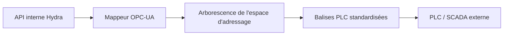

<p align="center">
  
</p>

# 🏭 HYDRA-UMC-OPCUA-SERVER

<p align="center"><a href="README.md">🇺🇸 English</a> | <a href="README_spa.md">🇪🇸 Español</a> | 🇫🇷 <b>Français</b> | <a href="README_ita.md">🇮🇹 Italiano</a> | <a href="README_deu.md">🇩🇪 Deutsch</a> | <a href="README_zho.md">🇨🇳 简体中文</a> | <a href="README_jpn.md">🇯🇵 日本語</a></p>

### 🛠️ Mappage des objets HydraState vers des espaces d'adressage OPC-UA standardisés

<p align="left">
  
  
  
</p>

---

## 1. 🛠️ APERÇU TECHNIQUE

**HYDRA-UMC-OPCUA-SERVER** est le module de modélisation industrielle central de la passerelle (Gateway). Il traduit l'HydraState interne et dynamique (JSON) en un espace d'adressage OPC-UA structuré et découvrable.

Il permet aux logiciels d'automatisation industrielle (comme Ignition, Siemens TIA Portal ou Rockwell FactoryTalk) de parcourir, lire et écrire dans les variables robotiques comme s'il s'agissait de balises (tags) PLC standard.

### Caractéristiques principales :
* 🛠️ **Modélisation dynamique des informations :** Génère automatiquement l'arborescence OPC-UA en fonction des robots et des outils actifs.
* 🔄 **Accès en lecture/écriture :** Contrôle sécurisé des articulations et des effecteurs robotiques à partir des clients PLC.
* 🔖 **Espace de noms versionné & NodeIds stables :** Une URI d'espace de noms réelle et explicite, ainsi que des NodeIds de type chaîne explicites - une mise à jour de l'espace d'adressage ne peut pas changer silencieusement le chemin dont dépend un client. *(implémenté)*
* 🔐 **Autorisation d'écriture par session :** Une vérification réelle et dynamique distinguant une session anonyme d'une session authentifiée - tous les clients n'obtiennent pas un accès en écriture par défaut. *(implémenté)*
* 📡 **Prise en charge des abonnements :** Mises à jour des données haute efficacité à l'aide des mécanismes de publication-abonnement OPC-UA.
* 🛡️ **Cryptage :** Prise en charge complète des politiques de sécurité signées et cryptées (Basic256Sha256).

---

## 2. 🔄 FLUX D'ESPACE D'ADRESSAGE OPC-UA



---

## 3. 🧱 ARCHITECTURE & DÉCISIONS DE CONCEPTION

* **Pourquoi c'est un frère, pas un sous-module, de HYDRA-UMC-GATEWAY-INDUSTRIAL.** Chaque adaptateur de protocole est un processus déployable/redémarrable séparément - un problème dans la bibliothèque cliente OPC-UA ne fait jamais tomber les adaptateurs MQTT ou MTConnect qui tournent à côté.
* **Pourquoi un espace d'adressage OPC-UA, pas un simple passthrough REST.** Les clients OPC-UA (SCADA/historiens) attendent un vrai espace d'adressage navigable avec des nœuds typés - un passthrough REST plat exposerait techniquement les données mais viderait de son sens le fait de parler OPC-UA.
* **Pourquoi le point d'entrée n'imprime qu'identité/version, et se termine après la mise en place d'un listener de health-check.** Étape d'andamiaje, même raison que le propre README du parent - une vraie passerelle est de longue durée par nature, donc prouver que le processus reste actif est le vrai premier jalon.
* **Comment cela s'intègre dans le reste de l'écosystème.** Un service frère sous HYDRA-UMC-GATEWAY-INDUSTRIAL - traduit le propre état de HYDRA-UMC-SERVER en un vrai espace d'adressage OPC-UA.
* **Des tests réels au niveau du protocole, pas seulement une vérification de compilation.** `tests/server.test.ts` connecte un vrai `OPCUAClient` (le client propre de node-opcua, la même bibliothèque qu'utiliseraient UAExpert/Ignition) à un vrai `OPCUAServer` via le vrai protocole binaire sur un vrai port TCP - ouverture d'une session, parcours/lecture de `SwarmOnline`/`ActiveRobotCount` par chemin, et confirmation qu'une écriture émise par le client se reflète à la fois dans la valeur relue et dans l'état interne du serveur.
* **Pourquoi des NodeIds de type chaîne explicites, et non les NodeIds numériques auto-assignés de node-opcua.** Un NodeId numérique est attribué selon l'ordre de création - insérer un nouveau DataItem avant un DataItem existant dans le code le renumérote silencieusement, cassant tout client industriel ayant codé en dur l'ancien numéro. Un NodeId explicite au format `s=HydraNode_1.SwarmOnline` ne peut jamais se déplacer sous un client simplement parce que le code de l'espace d'adressage a changé de forme.
* **Pourquoi `SpindleTemp` utilise `timestamped_get`, et non le `get()` plus simple utilisé par les autres variables.** `get()` horodate automatiquement chaque lecture avec l'heure actuelle - adapté à une valeur en direct, malhonnête pour une valeur qui évolue lentement (une broche ne se réchauffe pas entre deux interrogations). `timestamped_get` renvoie un vrai `DataValue` avec un `sourceTimestamp` explicite qui suit le moment où la valeur a réellement changé pour la dernière fois, la sémantique réelle sur laquelle s'appuie un historien OPC-UA.
* **Pourquoi l'autorisation d'écriture est par session (`isUserWritable`), et non un indicateur statique de niveau d'accès.** Un `userAccessLevel` statique ne peut pas distinguer la session d'un client de celle d'un autre - il est identique pour chaque connexion. Surcharger `isUserWritable(context)` sur le nœud variable est le mécanisme propre et documenté de node-opcua pour une vérification qui varie réellement par session, assez réelle pour être testée avec deux identités de client réelles différentes.

---

## 📂 STRUCTURE DES RÉPERTOIRES

```text
HYDRA-UMC-OPCUA-SERVER/
├── src/         # Code source (Node/TypeScript - Modèle, Serveur, Mappeur)
├── docs/        # Documentation et référence de mappage des balises
├── build/       # Sortie compilée (npm run build)
├── images/      # Médias et diagrammes
├── scripts/     # Scripts utilitaires (bump-version.mjs)
└── README.md
```

Service réseau pur, sans matériel propre - `hardware/`, `firmware/` et
`os/` sont omis conformément à la politique de structure du dépôt.

---

## 🛠️ ENVIRONNEMENT DE DÉVELOPPEMENT

### Prérequis
- [Node.js](https://nodejs.org/) (v18 ou supérieur recommandé)
- npm

### Installation
```bash
npm install
```

### Mode Développement
Exécute le serveur OPC-UA directement avec `tsx` (sans bundler) :
- **Windows :** double-cliquer sur `dev.bat` ou exécuter `npm run dev`
- **Linux/Mac :** exécuter `./dev.sh` ou `npm run dev`

### Build de Production
Regroupe le serveur en un seul fichier déployable avec esbuild :
- **Windows :** double-cliquer sur `build.bat` ou exécuter `npm run build`
- **Linux/Mac :** exécuter `./build.sh` ou `npm run build`

Puis démarrez-le avec :
```bash
npm start
```

Le serveur écoute sur `0.0.0.0:4840` (le port OPC-UA par défaut enregistré
par l'IANA) à l'endpoint `opc.tcp://<host>:4840/HYDRA-UMC-OPCUA-SERVER` -
pointez n'importe quel client OPC-UA (UAExpert, Ignition, Siemens TIA
Portal, ...) pour parcourir l'espace d'adressage.

### Gestion des versions
Chaque `npm run build` réel incrémente automatiquement le `version` de
`package.json` (`scripts/bump-version.mjs`, première étape du script
`build`) - un « compteur kilométrique » en base 10 : patch +1 par build,
avec report vers minor (et de minor vers major) au-delà de 9 plutôt que
d'atteindre un segment à deux chiffres (`0.0.9` -> `0.1.0`, pas `0.0.10`).

---

## 🚀 ROADMAP
* **Phase 1 :** Implémentation d'OPC-UA Pub/Sub pour l'échange de données à haute vitesse et le pontage des protocoles hérités.
* **Phase 2 :** Cluster de brokers MQTT pour la gestion massive des appareils IoT et une haute simultanéité.
* **Phase 3 :** Prise en charge de l''adaptateur MTConnect pour l'intégration de machines CNC et d'automates multi-fournisseurs.
* **Phase 4 :** Conformité totale avec la spécification compagnon OPC UA Robotics et synchronisation de la passerelle industrielle.

---

## 🔗 Projets Liés

Ce projet fait partie d'un écosystème robotique plus large du même auteur (JuanenRac / Electro Hobby 3D), couvrant firmware, logiciel de contrôle, nœuds IA et outillage de flotte. Bon à savoir, car une demande pourrait en réalité concerner l'un de ces projets plutôt que ce dépôt.

### Famille

**Parent :** **[HYDRA-UMC-GATEWAY-INDUSTRIAL](https://github.com/JuanenRac/HYDRA-UMC-GATEWAY-INDUSTRIAL)** — le parent d'intégration auquel se connecte cet adaptateur OPC-UA.

**Frères et sœurs :**
- **[HYDRA-UMC-MQTT-BROKER](https://github.com/JuanenRac/HYDRA-UMC-MQTT-BROKER)** — adaptateur de protocole frère, même parent.
- **[HYDRA-UMC-MTCONNECT-ADAPTER](https://github.com/JuanenRac/HYDRA-UMC-MTCONNECT-ADAPTER)** — adaptateur de protocole frère, même parent.

### Relation Directe (hors de la famille)

- **[HYDRA-UMC-SERVER](https://github.com/JuanenRac/HYDRA-UMC-SERVER)** — la source de l'état exposé par cet adaptateur.

### Reste de l'Écosystème

**Plateforme HYDRA-UMC** — la cellule de micro-usine multi-robot
- **[HYDRA-UMC](https://github.com/JuanenRac/HYDRA-UMC)** — la carte mère CM5 + STM32H745 orchestrant jusqu'à 8 bras robotiques.
- **[HYDRA-UMC-SERVER](https://github.com/JuanenRac/HYDRA-UMC-SERVER)** — le backend Express/WebSocket auquel parle chaque client de contrôle.
- **[HYDRA-UMC-STUDIO](https://github.com/JuanenRac/HYDRA-UMC-STUDIO)** — tableau de bord de contrôle web, visualisation 3D multi-robot.
- **[HYDRA-UMC-ANDROID-CONTROL](https://github.com/JuanenRac/HYDRA-UMC-ANDROID-CONTROL)** — application de contrôle Android via Wi-Fi/Bluetooth.
- **[HYDRA-UMC-IOS-CONTROL](https://github.com/JuanenRac/HYDRA-UMC-IOS-CONTROL)** — application de contrôle iOS/iPadOS construite en Flutter.
- **[HYDRA-UMC-SUITE](https://github.com/JuanenRac/HYDRA-UMC-SUITE)** — centre de commande d'essaim de bureau (Python/PySide6).
- **[HYDRA-UMC-EDITOR-URDF](https://github.com/JuanenRac/HYDRA-UMC-EDITOR-URDF)** — éditeur de modèles URDF de bureau pour le catalogue de robots.
- **[HYDRA-UMC-DSI](https://github.com/JuanenRac/HYDRA-UMC-DSI)** — interface tactile native pour l'écran DSI embarqué.

**Plateforme URTC** — le contrôleur de tête d'outil que porte chaque bras HYDRA-UMC
- **[URTC](https://github.com/JuanenRac/URTC)** — contrôleur de tête d'outil sur bus CAN, 25 profils d'outil.
- **[URTC-FLASHER](https://github.com/JuanenRac/URTC-FLASHER)** — outil de bureau de flashage CAN-OTA + SWD/JTAG.
- **[URTC-TESTER](https://github.com/JuanenRac/URTC-TESTER)** — outil de bureau de diagnostic CAN en direct.
- **[URTC-WEB-STUDIO](https://github.com/JuanenRac/URTC-WEB-STUDIO)** — alternative basée navigateur via l'API Web Serial.

**🎥 Vision AI Node (Hailo-8)**
- [HYDRA-UMC-VISION-NODE](https://github.com/JuanenRac/HYDRA-UMC-VISION-NODE)
- [HYDRA-UMC-VISION-STREAMER](https://github.com/JuanenRac/HYDRA-UMC-VISION-STREAMER)
- [HYDRA-UMC-DETECTION-HEF](https://github.com/JuanenRac/HYDRA-UMC-DETECTION-HEF)
- [HYDRA-UMC-SAFETY-ZONES](https://github.com/JuanenRac/HYDRA-UMC-SAFETY-ZONES)
- [HYDRA-UMC-VISUAL-SERVOING-API](https://github.com/JuanenRac/HYDRA-UMC-VISUAL-SERVOING-API)

**🧠 Cognitive AI Node (Hailo-10)**
- [HYDRA-UMC-COGNITIVE-NODE](https://github.com/JuanenRac/HYDRA-UMC-COGNITIVE-NODE)
- [HYDRA-UMC-VLA-ENGINE](https://github.com/JuanenRac/HYDRA-UMC-VLA-ENGINE)
- [HYDRA-UMC-VOICE-UI](https://github.com/JuanenRac/HYDRA-UMC-VOICE-UI)
- [HYDRA-UMC-SEMANTIC-PLANNER](https://github.com/JuanenRac/HYDRA-UMC-SEMANTIC-PLANNER)
- [HYDRA-UMC-DOCS-QA](https://github.com/JuanenRac/HYDRA-UMC-DOCS-QA)

**🐝 Orchestration & Swarm**
- [HYDRA-UMC-ORCHESTRATOR](https://github.com/JuanenRac/HYDRA-UMC-ORCHESTRATOR)
- [HYDRA-UMC-SWARM-SYNC](https://github.com/JuanenRac/HYDRA-UMC-SWARM-SYNC)
- [HYDRA-UMC-PATH-PLANNER-3D](https://github.com/JuanenRac/HYDRA-UMC-PATH-PLANNER-3D)
- [HYDRA-UMC-JOB-DISPATCHER](https://github.com/JuanenRac/HYDRA-UMC-JOB-DISPATCHER)
- [HYDRA-UMC-NODE-HEALING](https://github.com/JuanenRac/HYDRA-UMC-NODE-HEALING)

**🎮 Digital Twin & Simulation**
- [HYDRA-UMC-TWIN](https://github.com/JuanenRac/HYDRA-UMC-TWIN)
- [HYDRA-UMC-PHYSICS-REPLICA](https://github.com/JuanenRac/HYDRA-UMC-PHYSICS-REPLICA)
- [HYDRA-UMC-HIL-BRIDGE](https://github.com/JuanenRac/HYDRA-UMC-HIL-BRIDGE)
- [HYDRA-UMC-SYNTHETIC-DATA-GEN](https://github.com/JuanenRac/HYDRA-UMC-SYNTHETIC-DATA-GEN)

**📊 Data & Analytics**
- [HYDRA-UMC-DATALAKE](https://github.com/JuanenRac/HYDRA-UMC-DATALAKE)
- [HYDRA-UMC-TELEMETRY-COLLECTOR](https://github.com/JuanenRac/HYDRA-UMC-TELEMETRY-COLLECTOR)
- [HYDRA-UMC-ANOMALY-DETECTOR](https://github.com/JuanenRac/HYDRA-UMC-ANOMALY-DETECTOR)
- [HYDRA-UMC-PRODUCTION-REPORTS](https://github.com/JuanenRac/HYDRA-UMC-PRODUCTION-REPORTS)

**🛠️ Complementary Tools**
- [URTC-SMART-RACK](https://github.com/JuanenRac/URTC-SMART-RACK)
- [URTC-VISION-TOOL](https://github.com/JuanenRac/URTC-VISION-TOOL)
- [HYDRA-UMC-WATCH](https://github.com/JuanenRac/HYDRA-UMC-WATCH)
- [HYDRA-UMC-TOOL-CLI](https://github.com/JuanenRac/HYDRA-UMC-TOOL-CLI)
- [HYDRA-UMC-DASHBOARD-AI](https://github.com/JuanenRac/HYDRA-UMC-DASHBOARD-AI)


## 👤 AUTEUR
**JuanenRac** (Electro Hobby 3D)
📧 electrohobby3d@gmail.com

## 📜 LICENCE
GPL-3.0 - Voir le fichier LICENSE pour plus de détails.
