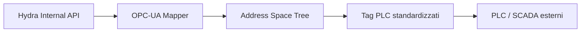

<p align="center">
  
</p>

# 🏭 HYDRA-UMC-OPCUA-SERVER

<p align="center"><a href="README.md">🇺🇸 English</a> | <a href="README_spa.md">🇪🇸 Español</a> | <a href="README_fra.md">🇫🇷 Français</a> | 🇮🇹 <b>Italiano</b> | <a href="README_deu.md">🇩🇪 Deutsch</a> | <a href="README_zho.md">🇨🇳 简体中文</a> | <a href="README_jpn.md">🇯🇵 日本語</a></p>

### 🛠️ Mappatura degli oggetti HydraState su spazi di indirizzamento OPC-UA standardizzati

<p align="left">
  
  
  
</p>

---

## 1. 🛠️ PANORAMICA TECNICA

**HYDRA-UMC-OPCUA-SERVER** è il modulo di modellazione industriale principale per il Gateway. Traduce l'HydraState interno e dinamico (JSON) in uno spazio di indirizzamento OPC-UA strutturato e individuabile.

Consente ai software di automazione industriale (come Ignition, Siemens TIA Portal o Rockwell FactoryTalk) di sfogliare, leggere e scrivere nelle variabili robotiche come se fossero tag PLC standard.

### Caratteristiche principali:
* 🛠️ **Modellazione dinamica delle informazioni:** Genera automaticamente l'albero OPC-UA in base ai robot e agli strumenti attivi.
* 🔄 **Accesso in lettura/scrittura:** Controllo sicuro dei giunti e degli effettori robotici dai client PLC.
* 🔖 **Namespace Versionato e NodeId Stabili:** Un URI di namespace reale ed esplicito, e NodeId di tipo stringa espliciti - un aggiornamento dell'address space non può cambiare silenziosamente il percorso da cui dipende un client. *(implementato)*
* 🔐 **Autorizzazione di Scrittura per Sessione:** Un controllo reale e dinamico che distingue una sessione anonima da una autenticata - non tutti i client ottengono l'accesso in scrittura per impostazione predefinita. *(implementato)*
* 📡 **Supporto alle sottoscrizioni:** Aggiornamenti dei dati ad alta efficienza utilizzando i meccanismi publish-subscribe di OPC-UA.
* 🛡️ **Crittografia:** Supporto completo per le policy di sicurezza Signed ed Encrypted (Basic256Sha256).

---

## 2. 🔄 FLUSSO DELLO SPAZIO DI INDIRIZZAMENTO OPC-UA



---

## 3. 🧱 ARCHITETTURA E DECISIONI DI PROGETTAZIONE

* **Perché è fratello, non un sottomodulo, di HYDRA-UMC-GATEWAY-INDUSTRIAL.** Ogni adattatore di protocollo è un processo distribuibile/riavviabile separatamente - un problema nella libreria client OPC-UA non abbatte mai gli adattatori MQTT o MTConnect che girano accanto.
* **Perché un address space OPC-UA, non un semplice passthrough REST.** I client OPC-UA (SCADA/storici) si aspettano un vero address space navigabile con nodi tipizzati - un passthrough REST piatto esporrebbe tecnicamente i dati ma vanificherebbe il senso di parlare OPC-UA.
* **Perché il punto di ingresso stampa solo identità/versione, e termina dopo che un listener di health-check si avvia.** Fase di andamiaje, stesso motivo del README proprio del genitore - un vero gateway è di lunga durata per natura, quindi dimostrare che il processo resta attivo è il vero primo traguardo.
* **Come si inserisce nel resto dell'ecosistema.** Un servizio fratello sotto HYDRA-UMC-GATEWAY-INDUSTRIAL - traduce lo stato proprio di HYDRA-UMC-SERVER in un vero address space OPC-UA.
* **Test reali a livello di protocollo, non solo un controllo di compilazione.** `tests/server.test.ts` connette un `OPCUAClient` reale (il client proprio di node-opcua, la stessa libreria che userebbero UAExpert/Ignition) a un `OPCUAServer` reale tramite il vero protocollo binario su una porta TCP reale - aprendo una sessione, navigando/leggendo `SwarmOnline`/`ActiveRobotCount` per percorso, e confermando che una scrittura emessa dal client si riflette sia nel valore riletto sia nello stato interno del server.
* **Perché NodeId di tipo stringa espliciti, non quelli numerici auto-assegnati di node-opcua.** Un NodeId numerico viene assegnato in base all'ordine di creazione - inserire un nuovo DataItem prima di uno esistente nel codice lo rinumererebbe silenziosamente, rompendo qualsiasi client industriale che avesse il vecchio numero hardcoded. Un NodeId esplicito in stile `s=HydraNode_1.SwarmOnline` non può mai spostarsi sotto un client solo perché il codice dell'address space ha cambiato forma.
* **Perché `SpindleTemp` usa `timestamped_get`, non il più semplice `get()` usato dalle altre variabili.** `get()` marca automaticamente ogni lettura con l'ora corrente - adatto per un valore live, disonesto per uno che cambia lentamente (un mandrino non si riscalda di nuovo tra un polling e l'altro). `timestamped_get` restituisce un vero `DataValue` con un `sourceTimestamp` esplicito che traccia quando il valore è realmente cambiato l'ultima volta, la semantica reale su cui si basa uno storico OPC-UA.
* **Perché l'autorizzazione di scrittura è per sessione (`isUserWritable`), non un flag statico di livello di accesso.** Un `userAccessLevel` statico non può distinguere la sessione di un client da quella di un altro - è lo stesso per ogni connessione. Sovrascrivere `isUserWritable(context)` sul nodo variabile è il meccanismo proprio e documentato di node-opcua per un controllo che varia realmente per sessione, abbastanza reale da poter essere testato con due identità client reali diverse.

Vedere `mejoras_futuras.txt` per l'elenco onesto di ciò che è deliberatamente rimandato e perché (l'albero dinamico per robot, la reale copertura di test per crittografia/sottoscrizioni, e il punto Pub/Sub della roadmap).

---

## 📂 STRUTTURA DELLE CARTELLE

```text
HYDRA-UMC-OPCUA-SERVER/
├── src/         # Codice sorgente (Node/TypeScript - Modello, Server, Mapper)
├── tests/       # Suite Vitest - comportamento di server e sicurezza
├── build/       # Output compilato (npm run build)
├── images/      # Media e diagrammi
├── scripts/     # Script di utilità (bump-version.mjs)
├── tools/       # ci_validate.py - validazione manifest/CHANGELOG/docs usata dalla CI
└── README.md
```

Servizio di rete puro, senza hardware proprio - `hardware/`, `firmware/`
e `os/` sono omesse secondo la politica della struttura del repository.

---

## 🛠️ AMBIENTE DI SVILUPPO

### Requisiti
- [Node.js](https://nodejs.org/) (v18 o superiore consigliato)
- npm

### Installazione
```bash
npm install
```

### Modalità Sviluppo
Esegue il server OPC-UA direttamente con `tsx` (senza bundler):
- **Windows:** doppio clic su `dev.bat` oppure eseguire `npm run dev`
- **Linux/Mac:** eseguire `./dev.sh` oppure `npm run dev`

### Build di Produzione
Impacchetta il server in un unico file distribuibile con esbuild:
- **Windows:** doppio clic su `build.bat` oppure eseguire `npm run build`
- **Linux/Mac:** eseguire `./build.sh` oppure `npm run build`

Poi avvialo con:
```bash
npm start
```

Il server resta in ascolto su `0.0.0.0:4840` (la porta OPC-UA predefinita
registrata IANA) all'endpoint
`opc.tcp://<host>:4840/HYDRA-UMC-OPCUA-SERVER` - punta qualsiasi client
OPC-UA (UAExpert, Ignition, Siemens TIA Portal, ...) per esplorare lo
spazio di indirizzamento.

### Versionamento
Ogni `npm run build` reale incrementa automaticamente il `version` di
`package.json` (`scripts/bump-version.mjs`, primo passo dello script
`build`) - un "contachilometri" in base 10: patch +1 per build, con
riporto a minor (e da minor a major) oltre il 9 invece di raggiungere mai
un segmento a due cifre (`0.0.9` -> `0.1.0`, non `0.0.10`).

---

## 🚀 TABELLA DI MARCIA
* **Fase 1:** Implementazione di OPC-UA Pub/Sub per lo scambio di dati ad alta velocità e bridging di protocolli legacy.
* **Fase 2:** Cluster MQTT Broker per la gestione massiva di dispositivi IoT e alta concorrenza.
* **Fase 3:** Supporto per l'adattatore MTConnect per l'integrazione di macchinari CNC e PLC multi-vendor.
* **Fase 4:** Piena conformità alla specifica companion OPC UA Robotics e sincronizzazione del gateway industriale.

---

## 🔗 Progetti Correlati

Questo progetto fa parte dell'ecosistema robotico HYDRA-UMC dello stesso autore (JuanenRac / Electro Hobby 3D). Vale la pena conoscerlo, poiché una richiesta potrebbe in realtà riguardare uno di questi invece di questo repository.

**Progetto Padre**
- **[HYDRA-UMC-GATEWAY-INDUSTRIAL](https://github.com/JuanenRac/HYDRA-UMC-GATEWAY-INDUSTRIAL)** — hub di integrazione che inoltra ai protocolli industriali, con un vero livello di allowlist dei comandi/backpressure; il genitore di cui questo repository è un adattatore di protocollo specifico, all'interno del proprio gateway industriale.

**Progetti Fratelli** — gli altri adattatori di protocollo del gateway industriale proprio di HYDRA-UMC-GATEWAY-INDUSTRIAL
- **[HYDRA-UMC-MQTT-BROKER](https://github.com/JuanenRac/HYDRA-UMC-MQTT-BROKER)** — vero broker MQTT con autenticazione opzionale per client e ACL sui topic.
- **[HYDRA-UMC-MTCONNECT-ADAPTER](https://github.com/JuanenRac/HYDRA-UMC-MTCONNECT-ADAPTER)** — veri endpoint XML `/probe` e `/current` di MTConnect, con output in modalità degradata.

**Direttamente Correlati**
- **[HYDRA-UMC-SERVER](https://github.com/JuanenRac/HYDRA-UMC-SERVER)** — il vero backend headless (REST/WebSocket) con cui parla davvero ogni client di controllo — la fonte dello stato che questo adattatore espone.

**Fa Anche Parte dell'Ecosistema**

*Hardware e Piattaforma di Base*
- **[HYDRA-UMC](https://github.com/JuanenRac/HYDRA-UMC)** — la scheda madre fisica del braccio robotico: host CM5 + coprocessore STM32H745 dual-core, che coordina fino a 8 bracci utensile via CAN-OTA/SPI-OTA.
- **[HYDRA-UMC-OS](https://github.com/JuanenRac/HYDRA-UMC-OS)** — livello prodotto riproducibile su Raspberry Pi OS per il CM5: agente in sola lettura, config/profili validati, provisioning WiFi al primo contatto.
- **[HYDRA-UMC-SDK](https://github.com/JuanenRac/HYDRA-UMC-SDK)** — il contratto JSON-Schema condiviso e la barriera di sicurezza contro cui ogni bridge valida i propri comandi.

*Backend Centrale e Client*
- **[HYDRA-UMC-STUDIO](https://github.com/JuanenRac/HYDRA-UMC-STUDIO)** — dashboard di controllo web con visualizzazione 3D multi-robot in tempo reale.
- **[HYDRA-UMC-SUITE](https://github.com/JuanenRac/HYDRA-UMC-SUITE)** — centro di comando sciame desktop (PySide6) per più server contemporaneamente, pacchettizzato come eseguibile standalone.
- **[HYDRA-UMC-ANDROID-CONTROL](https://github.com/JuanenRac/HYDRA-UMC-ANDROID-CONTROL)** — app di controllo nativa per Android con login biometrico e un companion Wear OS abbinato.
- **[HYDRA-UMC-IOS-CONTROL](https://github.com/JuanenRac/HYDRA-UMC-IOS-CONTROL)** — app di controllo per iOS/iPadOS (Flutter) con sincronizzazione WebSocket in tempo reale.
- **[HYDRA-UMC-DSI](https://github.com/JuanenRac/HYDRA-UMC-DSI)** — interfaccia touch nativa per il touchscreen DSI da 7" a bordo, incorporata direttamente nel CM5.
- **[HYDRA-UMC-EDITOR-URDF](https://github.com/JuanenRac/HYDRA-UMC-EDITOR-URDF)** — creatore/editor grafico desktop di URDF che invia i modelli finiti al catalogo di STUDIO.
- **[HYDRA-UMC-BRIDGE-AMR](https://github.com/JuanenRac/HYDRA-UMC-BRIDGE-AMR)** — barriera di coordinamento per flotte AGV/AMR tramite un publisher MQTT VDA 5050 reale.
- **[HYDRA-UMC-BRIDGE-CNC](https://github.com/JuanenRac/HYDRA-UMC-BRIDGE-CNC)** — coordinatore ad alto livello per celle CNC con accesso reale a stato/byte di controllo GRBL.
- **[HYDRA-UMC-BRIDGE-DROIDS](https://github.com/JuanenRac/HYDRA-UMC-BRIDGE-DROIDS)** — barriera di coordinamento per droidi con zampe/umanoidi, con un vero mittente di comandi per Boston Dynamics Spot.
- **[HYDRA-UMC-BRIDGE-LASER](https://github.com/JuanenRac/HYDRA-UMC-BRIDGE-LASER)** — coordinatore di sicurezza per celle laser che legge 3 salvaguardie GPIO reali di chiave/involucro/interblocco.
- **[HYDRA-UMC-BRIDGE-OPENPNP](https://github.com/JuanenRac/HYDRA-UMC-BRIDGE-OPENPNP)** — coordinatore ad alto livello sicuro per il flusso schede del pick-and-place OpenPnP.
- **[HYDRA-UMC-BRIDGE-PRINTER3D](https://github.com/JuanenRac/HYDRA-UMC-BRIDGE-PRINTER3D)** — barriera di coordinamento sicura per stampanti 3D Moonraker/Klipper, con comandi di lavoro reali e controllati.
- **[HYDRA-UMC-BRIDGE-ROS2](https://github.com/JuanenRac/HYDRA-UMC-BRIDGE-ROS2)** — coordinatore di sicurezza con un vero trasporto ROS 2 rclpy, importato in modo lazy.
- **[HYDRA-UMC-BRIDGE-UAV](https://github.com/JuanenRac/HYDRA-UMC-BRIDGE-UAV)** — barriera di coordinamento per UAV dotati di fotocamera, con un vero mittente di comandi MAVLink.

*Piattaforma Strumenti URTC*
- **[URTC](https://github.com/JuanenRac/URTC)** — firmware per la scheda fisica dell'Universal Robot Tool Controller, oltre 25 profili utensile su bus CAN.
- **[URTC-FLASHER](https://github.com/JuanenRac/URTC-FLASHER)** — strumento desktop con GUI per il flashing delle schede URTC, CAN-OTA più SWD/JTAG a chip intero.
- **[URTC-TESTER](https://github.com/JuanenRac/URTC-TESTER)** — strumento desktop di diagnostica CAN-bus dal vivo per schede URTC, un pannello per profilo utensile.
- **[URTC-WEB-STUDIO](https://github.com/JuanenRac/URTC-WEB-STUDIO)** — alternativa basata su browser a URTC-TESTER tramite la Web Serial API, senza installazione locale.

*Nodo IA Visione (Hailo-8)*
- **[HYDRA-UMC-VISION-NODE](https://github.com/JuanenRac/HYDRA-UMC-VISION-NODE)** — hub di integrazione per la pipeline di visione Hailo-8, con un vero controllo di prontezza hardware per fase.
- **[HYDRA-UMC-DETECTION-HEF](https://github.com/JuanenRac/HYDRA-UMC-DETECTION-HEF)** — registro reale di modelli compilati con verifica di caricamento sicuro per architettura Hailo/checksum.
- **[HYDRA-UMC-VISION-STREAMER](https://github.com/JuanenRac/HYDRA-UMC-VISION-STREAMER)** — generatore reale di pipeline GStreamer + config MediaMTX, con una vera barriera di integrazione HailoRT.
- **[HYDRA-UMC-VISUAL-SERVOING-API](https://github.com/JuanenRac/HYDRA-UMC-VISUAL-SERVOING-API)** — vera legge di correzione Position-Based Visual Servoing, con cancello di sicurezza sullo stato di zona a monte.
- **[HYDRA-UMC-SAFETY-ZONES](https://github.com/JuanenRac/HYDRA-UMC-SAFETY-ZONES)** — vero controllo di violazione zona e richiesta E-STOP, con imposizione della freschezza di calibrazione.

*Nodo IA Cognitivo (Hailo-10)*
- **[HYDRA-UMC-COGNITIVE-NODE](https://github.com/JuanenRac/HYDRA-UMC-COGNITIVE-NODE)** — hub di integrazione per la pipeline cognitiva Hailo-10 (orchestrazione LLM/VLA/voce).
- **[HYDRA-UMC-VLA-ENGINE](https://github.com/JuanenRac/HYDRA-UMC-VLA-ENGINE)** — vera codifica/decodifica di token d'azione e generazione di traiettoria per un modello Vision-Language-Action.
- **[HYDRA-UMC-VOICE-UI](https://github.com/JuanenRac/HYDRA-UMC-VOICE-UI)** — vero front-end vocale (VAD + parser di intenti) con un relay verso Watch limitato e soggetto a conferma.
- **[HYDRA-UMC-SEMANTIC-PLANNER](https://github.com/JuanenRac/HYDRA-UMC-SEMANTIC-PLANNER)** — vera scomposizione dei task basata su regole e recupero semantico degli errori sui codici errore MCU.
- **[HYDRA-UMC-DOCS-QA](https://github.com/JuanenRac/HYDRA-UMC-DOCS-QA)** — vera ricerca documentale TF-IDF (solo libreria standard) sui documenti Markdown di questo ecosistema.

*Orchestrazione e Sciame*
- **[HYDRA-UMC-ORCHESTRATOR](https://github.com/JuanenRac/HYDRA-UMC-ORCHESTRATOR)** — hub di integrazione con un vero contratto di health-report gRPC/Protobuf e una macchina a stati di missione.
- **[HYDRA-UMC-JOB-DISPATCHER](https://github.com/JuanenRac/HYDRA-UMC-JOB-DISPATCHER)** — vera coda di lavori basata su priorità con deduplicazione, su una vera API HTTP.
- **[HYDRA-UMC-NODE-HEALING](https://github.com/JuanenRac/HYDRA-UMC-NODE-HEALING)** — vero watchdog di salute della flotta basato su gRPC, con retry/backoff e rilevamento di discrepanza d'identità.
- **[HYDRA-UMC-PATH-PLANNER-3D](https://github.com/JuanenRac/HYDRA-UMC-PATH-PLANNER-3D)** — vero pianificatore di percorsi 3D basato su RRT, con vera validazione delle collisioni ostacolo/spazio di lavoro.
- **[HYDRA-UMC-SWARM-SYNC](https://github.com/JuanenRac/HYDRA-UMC-SWARM-SYNC)** — vera sincronizzazione di stato CRDT LWW-Element-Map, con property test per la convergenza multi-cella.

*Gemello Digitale e Simulazione*
- **[HYDRA-UMC-TWIN](https://github.com/JuanenRac/HYDRA-UMC-TWIN)** — hub di integrazione per il motore di gemello digitale, con un vero contratto di sincronizzazione per compatibilità di versione.
- **[HYDRA-UMC-HIL-BRIDGE](https://github.com/JuanenRac/HYDRA-UMC-HIL-BRIDGE)** — vero interblocco di sicurezza hardware-in-the-loop che instrada i comandi tra simulazione e hardware reale.
- **[HYDRA-UMC-PHYSICS-REPLICA](https://github.com/JuanenRac/HYDRA-UMC-PHYSICS-REPLICA)** — vera cinematica diretta e validazione dei limiti articolari su un vero sottoinsieme URDF.
- **[HYDRA-UMC-SYNTHETIC-DATA-GEN](https://github.com/JuanenRac/HYDRA-UMC-SYNTHETIC-DATA-GEN)** — vero generatore procedurale di scene 2D con esportazione di annotazioni YOLO/COCO.

*Dati e Analisi*
- **[HYDRA-UMC-DATALAKE](https://github.com/JuanenRac/HYDRA-UMC-DATALAKE)** — vero archivio di serie temporali basato su sqlite3, con una vera API HTTP di ingestione/query.
- **[HYDRA-UMC-ANOMALY-DETECTOR](https://github.com/JuanenRac/HYDRA-UMC-ANOMALY-DETECTOR)** — vero rilevatore di anomalie FFT + baseline statistica, con monitoraggio della deriva.
- **[HYDRA-UMC-PRODUCTION-REPORTS](https://github.com/JuanenRac/HYDRA-UMC-PRODUCTION-REPORTS)** — vero calcolo OEE/disponibilità sullo storico di DATALAKE, con esportazione CSV riproducibile.
- **[HYDRA-UMC-TELEMETRY-COLLECTOR](https://github.com/JuanenRac/HYDRA-UMC-TELEMETRY-COLLECTOR)** — vera pipeline di ingestione CAN/WebSocket verso DATALAKE, con deduplicazione per sequenza.

*Strumenti Complementari e Operazioni dell'Ecosistema*
- **[HYDRA-UMC-DASHBOARD-AI](https://github.com/JuanenRac/HYDRA-UMC-DASHBOARD-AI)** — pannelli Smart Summaries e Anomaly Highlighting su DATALAKE/ANOMALY-DETECTOR, con un fallback statistico onesto.
- **[HYDRA-UMC-TOOL-CLI](https://github.com/JuanenRac/HYDRA-UMC-TOOL-CLI)** — CLI di flotta con un vero e stabile contratto di exit-code, un client live reale della stessa API di HYDRA-UMC-SERVER.
- **[HYDRA-UMC-WATCH](https://github.com/JuanenRac/HYDRA-UMC-WATCH)** — app companion WearOS con avvisi aptici reali e un relay vocale verso il telefono abbinato.
- **[URTC-SMART-RACK](https://github.com/JuanenRac/URTC-SMART-RACK)** — firmware per un rack di montaggio schede con decodifica reale dell'ID utensile e logica di preriscaldamento Smart Idle.
- **[URTC-VISION-TOOL](https://github.com/JuanenRac/URTC-VISION-TOOL)** — firmware più un vero companion di visione Python per una testa utensile di ispezione termica/RGB.
- **[HYDRA-UMC-UPDATER](https://github.com/JuanenRac/HYDRA-UMC-UPDATER)** — strumento amministrativo desktop che scopre, clona e aggiorna ogni repository di questo ecosistema.
- **[HYDRA-UMC-OS-REBUILDER](https://github.com/JuanenRac/HYDRA-UMC-OS-REBUILDER)** — strumento desktop Windows/Linux che costruisce un'immagine della CM5 pronta da scrivere, precaricata con le versioni più aggiornate dell'ecosistema, con configurazione di primo avvio Wi-Fi/utente/SSH in stile Raspberry Pi Imager.


---

## 📚 Documentazione e Comunità

- **[CONTRIBUTING.md](CONTRIBUTING.md)** — stack tecnologico e linee guida di codifica per una pull request.
- **[CODE_OF_CONDUCT.md](CODE_OF_CONDUCT.md)** — gli standard di comportamento attesi in questa comunità.
- **[SECURITY.md](SECURITY.md)** — come segnalare una vulnerabilità, e le reali aree di attenzione sulla sicurezza di questo progetto.
- **[SUPPORT.md](SUPPORT.md)** — dove porre domande e segnalare bug.
- **[LICENSE.md](LICENSE.md)** — la licenza propria di questo progetto.

## 👤 AUTORE
**JuanenRac** (Electro Hobby 3D)
📧 electrohobby3d@gmail.com
📺 [youtube.com/@electrohobby3d](https://youtube.com/@electrohobby3d)

## 📜 LICENZA
GPL-3.0 - Vedere LICENSE per i dettagli.
