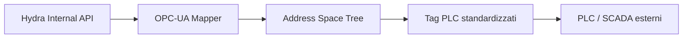

<p align="center">
  
</p>

# 🏭 HYDRA-UMC-OPCUA-SERVER

<p align="center"><a href="README.md">🇺🇸 English</a> | <a href="README_spa.md">🇪🇸 Español</a> | <a href="README_fra.md">🇫🇷 Français</a> | 🇮🇹 <b>Italiano</b> | <a href="README_deu.md">🇩🇪 Deutsch</a> | <a href="README_zho.md">🇨🇳 简体中文</a> | <a href="README_jpn.md">🇯🇵 日本語</a></p>

### 🛠️ Mappatura degli oggetti HydraState su spazi di indirizzamento OPC-UA standardizzati

<p align="left">
  
  
  
</p>

---

## 1. 🛠️ PANORAMICA TECNICA

**HYDRA-UMC-OPCUA-SERVER** è il modulo di modellazione industriale principale per il Gateway. Traduce l'HydraState interno e dinamico (JSON) in uno spazio di indirizzamento OPC-UA strutturato e individuabile.

Consente ai software di automazione industriale (come Ignition, Siemens TIA Portal o Rockwell FactoryTalk) di sfogliare, leggere e scrivere nelle variabili robotiche come se fossero tag PLC standard.

### Caratteristiche principali:
* 🛠️ **Modellazione dinamica delle informazioni:** Genera automaticamente l'albero OPC-UA in base ai robot e agli strumenti attivi.
* 🔄 **Accesso in lettura/scrittura:** Controllo sicuro dei giunti e degli effettori robotici dai client PLC.
* 🔖 **Namespace Versionato e NodeId Stabili:** Un URI di namespace reale ed esplicito, e NodeId di tipo stringa espliciti - un aggiornamento dell'address space non può cambiare silenziosamente il percorso da cui dipende un client. *(implementato)*
* 🔐 **Autorizzazione di Scrittura per Sessione:** Un controllo reale e dinamico che distingue una sessione anonima da una autenticata - non tutti i client ottengono l'accesso in scrittura per impostazione predefinita. *(implementato)*
* 📡 **Supporto alle sottoscrizioni:** Aggiornamenti dei dati ad alta efficienza utilizzando i meccanismi publish-subscribe di OPC-UA.
* 🛡️ **Crittografia:** Supporto completo per le policy di sicurezza Signed ed Encrypted (Basic256Sha256).

---

## 2. 🔄 FLUSSO DELLO SPAZIO DI INDIRIZZAMENTO OPC-UA



---

## 3. 🧱 ARCHITETTURA E DECISIONI DI PROGETTAZIONE

* **Perché è fratello, non un sottomodulo, di HYDRA-UMC-GATEWAY-INDUSTRIAL.** Ogni adattatore di protocollo è un processo distribuibile/riavviabile separatamente - un problema nella libreria client OPC-UA non abbatte mai gli adattatori MQTT o MTConnect che girano accanto.
* **Perché un address space OPC-UA, non un semplice passthrough REST.** I client OPC-UA (SCADA/storici) si aspettano un vero address space navigabile con nodi tipizzati - un passthrough REST piatto esporrebbe tecnicamente i dati ma vanificherebbe il senso di parlare OPC-UA.
* **Perché il punto di ingresso stampa solo identità/versione, e termina dopo che un listener di health-check si avvia.** Fase di andamiaje, stesso motivo del README proprio del genitore - un vero gateway è di lunga durata per natura, quindi dimostrare che il processo resta attivo è il vero primo traguardo.
* **Come si inserisce nel resto dell'ecosistema.** Un servizio fratello sotto HYDRA-UMC-GATEWAY-INDUSTRIAL - traduce lo stato proprio di HYDRA-UMC-SERVER in un vero address space OPC-UA.
* **Test reali a livello di protocollo, non solo un controllo di compilazione.** `tests/server.test.ts` connette un `OPCUAClient` reale (il client proprio di node-opcua, la stessa libreria che userebbero UAExpert/Ignition) a un `OPCUAServer` reale tramite il vero protocollo binario su una porta TCP reale - aprendo una sessione, navigando/leggendo `SwarmOnline`/`ActiveRobotCount` per percorso, e confermando che una scrittura emessa dal client si riflette sia nel valore riletto sia nello stato interno del server.
* **Perché NodeId di tipo stringa espliciti, non quelli numerici auto-assegnati di node-opcua.** Un NodeId numerico viene assegnato in base all'ordine di creazione - inserire un nuovo DataItem prima di uno esistente nel codice lo rinumererebbe silenziosamente, rompendo qualsiasi client industriale che avesse il vecchio numero hardcoded. Un NodeId esplicito in stile `s=HydraNode_1.SwarmOnline` non può mai spostarsi sotto un client solo perché il codice dell'address space ha cambiato forma.
* **Perché `SpindleTemp` usa `timestamped_get`, non il più semplice `get()` usato dalle altre variabili.** `get()` marca automaticamente ogni lettura con l'ora corrente - adatto per un valore live, disonesto per uno che cambia lentamente (un mandrino non si riscalda di nuovo tra un polling e l'altro). `timestamped_get` restituisce un vero `DataValue` con un `sourceTimestamp` esplicito che traccia quando il valore è realmente cambiato l'ultima volta, la semantica reale su cui si basa uno storico OPC-UA.
* **Perché l'autorizzazione di scrittura è per sessione (`isUserWritable`), non un flag statico di livello di accesso.** Un `userAccessLevel` statico non può distinguere la sessione di un client da quella di un altro - è lo stesso per ogni connessione. Sovrascrivere `isUserWritable(context)` sul nodo variabile è il meccanismo proprio e documentato di node-opcua per un controllo che varia realmente per sessione, abbastanza reale da poter essere testato con due identità client reali diverse.

---

## 📂 STRUTTURA DELLE CARTELLE

```text
HYDRA-UMC-OPCUA-SERVER/
├── src/         # Codice sorgente (Node/TypeScript - Modello, Server, Mapper)
├── docs/        # Documentazione e riferimento mappatura tag
├── build/       # Output compilato (npm run build)
├── images/      # Media e diagrammi
├── scripts/     # Script di utilità (bump-version.mjs)
└── README.md
```

Servizio di rete puro, senza hardware proprio - `hardware/`, `firmware/`
e `os/` sono omesse secondo la politica della struttura del repository.

---

## 🛠️ AMBIENTE DI SVILUPPO

### Requisiti
- [Node.js](https://nodejs.org/) (v18 o superiore consigliato)
- npm

### Installazione
```bash
npm install
```

### Modalità Sviluppo
Esegue il server OPC-UA direttamente con `tsx` (senza bundler):
- **Windows:** doppio clic su `dev.bat` oppure eseguire `npm run dev`
- **Linux/Mac:** eseguire `./dev.sh` oppure `npm run dev`

### Build di Produzione
Impacchetta il server in un unico file distribuibile con esbuild:
- **Windows:** doppio clic su `build.bat` oppure eseguire `npm run build`
- **Linux/Mac:** eseguire `./build.sh` oppure `npm run build`

Poi avvialo con:
```bash
npm start
```

Il server resta in ascolto su `0.0.0.0:4840` (la porta OPC-UA predefinita
registrata IANA) all'endpoint
`opc.tcp://<host>:4840/HYDRA-UMC-OPCUA-SERVER` - punta qualsiasi client
OPC-UA (UAExpert, Ignition, Siemens TIA Portal, ...) per esplorare lo
spazio di indirizzamento.

### Versionamento
Ogni `npm run build` reale incrementa automaticamente il `version` di
`package.json` (`scripts/bump-version.mjs`, primo passo dello script
`build`) - un "contachilometri" in base 10: patch +1 per build, con
riporto a minor (e da minor a major) oltre il 9 invece di raggiungere mai
un segmento a due cifre (`0.0.9` -> `0.1.0`, non `0.0.10`).

---

## 🚀 ROADMAP
* **Fase 1:** Implementazione di OPC-UA Pub/Sub per lo scambio di dati ad alta velocità e bridging di protocolli legacy.
* **Fase 2:** Cluster MQTT Broker per la gestione massiva di dispositivi IoT e alta concorrenza.
* **Fase 3:** Supporto per l'adattatore MTConnect per l'integrazione di macchinari CNC e PLC multi-vendor.
* **Fase 4:** Piena conformità alla specifica companion OPC UA Robotics e sincronizzazione del gateway industriale.

---

## 🔗 Progetti Correlati

Questo progetto fa parte di un ecosistema robotico più ampio dello stesso autore (JuanenRac / Electro Hobby 3D), che copre firmware, software di controllo, nodi IA e strumenti di flotta. Utile saperlo, perché una richiesta potrebbe in realtà riguardare uno di questi progetti anziché questo repository.

### Famiglia

**Genitore:** **[HYDRA-UMC-GATEWAY-INDUSTRIAL](https://github.com/JuanenRac/HYDRA-UMC-GATEWAY-INDUSTRIAL)** — il genitore di integrazione a cui si collega questo adattatore OPC-UA.

**Fratelli:**
- **[HYDRA-UMC-MQTT-BROKER](https://github.com/JuanenRac/HYDRA-UMC-MQTT-BROKER)** — adattatore di protocollo fratello, stesso genitore.
- **[HYDRA-UMC-MTCONNECT-ADAPTER](https://github.com/JuanenRac/HYDRA-UMC-MTCONNECT-ADAPTER)** — adattatore di protocollo fratello, stesso genitore.

### Relazione Diretta (fuori dalla famiglia)

- **[HYDRA-UMC-SERVER](https://github.com/JuanenRac/HYDRA-UMC-SERVER)** — la fonte dello stato esposto da questo adattatore.

### Resto dell'Ecosistema

**Piattaforma HYDRA-UMC** — la cella di micro-fabbrica multi-robot
- **[HYDRA-UMC](https://github.com/JuanenRac/HYDRA-UMC)** — la scheda madre CM5 + STM32H745 che orchestra fino a 8 bracci robotici.
- **[HYDRA-UMC-SERVER](https://github.com/JuanenRac/HYDRA-UMC-SERVER)** — il backend Express/WebSocket con cui parla ogni client di controllo.
- **[HYDRA-UMC-STUDIO](https://github.com/JuanenRac/HYDRA-UMC-STUDIO)** — dashboard di controllo web, visualizzazione 3D multi-robot.
- **[HYDRA-UMC-ANDROID-CONTROL](https://github.com/JuanenRac/HYDRA-UMC-ANDROID-CONTROL)** — app di controllo Android via Wi-Fi/Bluetooth.
- **[HYDRA-UMC-IOS-CONTROL](https://github.com/JuanenRac/HYDRA-UMC-IOS-CONTROL)** — app di controllo iOS/iPadOS costruita in Flutter.
- **[HYDRA-UMC-SUITE](https://github.com/JuanenRac/HYDRA-UMC-SUITE)** — centro di comando sciame desktop (Python/PySide6).
- **[HYDRA-UMC-EDITOR-URDF](https://github.com/JuanenRac/HYDRA-UMC-EDITOR-URDF)** — editor desktop di modelli URDF per il catalogo robot.
- **[HYDRA-UMC-DSI](https://github.com/JuanenRac/HYDRA-UMC-DSI)** — interfaccia touch nativa per lo schermo DSI a bordo.

**Piattaforma URTC** — il controller della testa utensile che ogni braccio HYDRA-UMC porta con sé
- **[URTC](https://github.com/JuanenRac/URTC)** — controller testa utensile su bus CAN, 25 profili utensile.
- **[URTC-FLASHER](https://github.com/JuanenRac/URTC-FLASHER)** — strumento desktop di flashing CAN-OTA + SWD/JTAG.
- **[URTC-TESTER](https://github.com/JuanenRac/URTC-TESTER)** — strumento desktop di diagnostica CAN live.
- **[URTC-WEB-STUDIO](https://github.com/JuanenRac/URTC-WEB-STUDIO)** — alternativa basata su browser via Web Serial API.

**🎥 Vision AI Node (Hailo-8)**
- [HYDRA-UMC-VISION-NODE](https://github.com/JuanenRac/HYDRA-UMC-VISION-NODE)
- [HYDRA-UMC-VISION-STREAMER](https://github.com/JuanenRac/HYDRA-UMC-VISION-STREAMER)
- [HYDRA-UMC-DETECTION-HEF](https://github.com/JuanenRac/HYDRA-UMC-DETECTION-HEF)
- [HYDRA-UMC-SAFETY-ZONES](https://github.com/JuanenRac/HYDRA-UMC-SAFETY-ZONES)
- [HYDRA-UMC-VISUAL-SERVOING-API](https://github.com/JuanenRac/HYDRA-UMC-VISUAL-SERVOING-API)

**🧠 Cognitive AI Node (Hailo-10)**
- [HYDRA-UMC-COGNITIVE-NODE](https://github.com/JuanenRac/HYDRA-UMC-COGNITIVE-NODE)
- [HYDRA-UMC-VLA-ENGINE](https://github.com/JuanenRac/HYDRA-UMC-VLA-ENGINE)
- [HYDRA-UMC-VOICE-UI](https://github.com/JuanenRac/HYDRA-UMC-VOICE-UI)
- [HYDRA-UMC-SEMANTIC-PLANNER](https://github.com/JuanenRac/HYDRA-UMC-SEMANTIC-PLANNER)
- [HYDRA-UMC-DOCS-QA](https://github.com/JuanenRac/HYDRA-UMC-DOCS-QA)

**🐝 Orchestration & Swarm**
- [HYDRA-UMC-ORCHESTRATOR](https://github.com/JuanenRac/HYDRA-UMC-ORCHESTRATOR)
- [HYDRA-UMC-SWARM-SYNC](https://github.com/JuanenRac/HYDRA-UMC-SWARM-SYNC)
- [HYDRA-UMC-PATH-PLANNER-3D](https://github.com/JuanenRac/HYDRA-UMC-PATH-PLANNER-3D)
- [HYDRA-UMC-JOB-DISPATCHER](https://github.com/JuanenRac/HYDRA-UMC-JOB-DISPATCHER)
- [HYDRA-UMC-NODE-HEALING](https://github.com/JuanenRac/HYDRA-UMC-NODE-HEALING)

**🎮 Digital Twin & Simulation**
- [HYDRA-UMC-TWIN](https://github.com/JuanenRac/HYDRA-UMC-TWIN)
- [HYDRA-UMC-PHYSICS-REPLICA](https://github.com/JuanenRac/HYDRA-UMC-PHYSICS-REPLICA)
- [HYDRA-UMC-HIL-BRIDGE](https://github.com/JuanenRac/HYDRA-UMC-HIL-BRIDGE)
- [HYDRA-UMC-SYNTHETIC-DATA-GEN](https://github.com/JuanenRac/HYDRA-UMC-SYNTHETIC-DATA-GEN)

**📊 Data & Analytics**
- [HYDRA-UMC-DATALAKE](https://github.com/JuanenRac/HYDRA-UMC-DATALAKE)
- [HYDRA-UMC-TELEMETRY-COLLECTOR](https://github.com/JuanenRac/HYDRA-UMC-TELEMETRY-COLLECTOR)
- [HYDRA-UMC-ANOMALY-DETECTOR](https://github.com/JuanenRac/HYDRA-UMC-ANOMALY-DETECTOR)
- [HYDRA-UMC-PRODUCTION-REPORTS](https://github.com/JuanenRac/HYDRA-UMC-PRODUCTION-REPORTS)

**🛠️ Complementary Tools**
- [URTC-SMART-RACK](https://github.com/JuanenRac/URTC-SMART-RACK)
- [URTC-VISION-TOOL](https://github.com/JuanenRac/URTC-VISION-TOOL)
- [HYDRA-UMC-WATCH](https://github.com/JuanenRac/HYDRA-UMC-WATCH)
- [HYDRA-UMC-TOOL-CLI](https://github.com/JuanenRac/HYDRA-UMC-TOOL-CLI)
- [HYDRA-UMC-DASHBOARD-AI](https://github.com/JuanenRac/HYDRA-UMC-DASHBOARD-AI)


## 👤 AUTORE
**JuanenRac** (Electro Hobby 3D)
📧 electrohobby3d@gmail.com

## 📜 LICENZA
GPL-3.0 - Vedere LICENSE per i dettagli.
