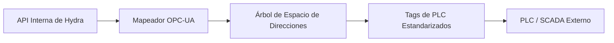

<p align="center">
  
</p>

# 🏭 HYDRA-UMC-OPCUA-SERVER

<p align="center"><a href="README.md">🇺🇸 English</a> | 🇪🇸 <b>Español</b> | <a href="README_fra.md">🇫🇷 Français</a> | <a href="README_ita.md">🇮🇹 Italiano</a> | <a href="README_deu.md">🇩🇪 Deutsch</a> | <a href="README_zho.md">🇨🇳 简体中文</a> | <a href="README_jpn.md">🇯🇵 日本語</a></p>

### 🛠️ Mapeo de Objetos HydraState a Espacios de Direcciones OPC-UA Estandarizados

<p align="left">
  
  
  
</p>

---

## 1. 🛠️ VISIÓN GENERAL TÉCNICA

**HYDRA-UMC-OPCUA-SERVER** es el módulo de modelado industrial central para el Gateway. Traduce el HydraState interno y dinámico (JSON) en un espacio de direcciones OPC-UA estructurado y descubrible.

Permite que el software de automatización industrial (como Ignition, Siemens TIA Portal o Rockwell FactoryTalk) explore, lea y escriba en variables robóticas como si fueran tags de PLC estándar.

### Características Clave:
* 🛠️ **Modelado de Información Dinámico:** Genera automáticamente el árbol OPC-UA basado en los robots y herramientas activos.
* 🔄 **Acceso Lectura/Escritura:** Control seguro de articulaciones y efectores robóticos desde clientes PLC.
* 🔖 **Espacio de Nombres Versionado y NodeIds Estables:** Una URI de espacio de nombres real y explícita, y NodeIds de tipo string explícitos - una actualización del espacio de direcciones no puede cambiar silenciosamente la ruta de la que depende un cliente. *(implementado)*
* 🔐 **Autorización de Escritura por Sesión:** Una comprobación real y dinámica que distingue una sesión anónima de una autenticada - no todos los clientes obtienen acceso de escritura por defecto. *(implementado)*
* 📡 **Soporte de Suscripción:** Actualizaciones de datos de alta eficiencia usando mecanismos de publicación-suscripción de OPC-UA.
* 🛡️ **Cifrado:** Soporte completo para políticas de seguridad firmadas y cifradas (Basic256Sha256).

---

## 2. 🔄 FLUJO DEL ESPACIO DE DIRECCIONES OPC-UA



---

## 3. 🧱 ARQUITECTURA Y DECISIONES DE DISEÑO

* **Por qué es hermano, no un submódulo, de HYDRA-UMC-GATEWAY-INDUSTRIAL.** Cada adaptador de protocolo es un proceso desplegable/reiniciable por separado - un problema en la librería cliente de OPC-UA nunca tumba los adaptadores de MQTT o MTConnect que corren junto a él.
* **Por qué un espacio de direcciones OPC-UA, no un simple passthrough REST.** Los clientes OPC-UA (SCADA/históricos) esperan un espacio de direcciones real y navegable con nodos tipados - un passthrough REST plano expondría técnicamente los datos pero anularía el sentido de hablar OPC-UA.
* **Por qué el punto de entrada solo imprime identidad/versión, y termina tras levantar un listener de health-check.** Etapa de andamiaje, mismo motivo que el propio README del padre - una pasarela real es de larga duración por naturaleza, así que probar que el proceso se mantiene en pie es el primer hito real.
* **Cómo encaja en el resto del ecosistema.** Un servicio hermano bajo HYDRA-UMC-GATEWAY-INDUSTRIAL - traduce el propio estado de HYDRA-UMC-SERVER a un espacio de direcciones OPC-UA real.
* **Tests reales a nivel de protocolo, no solo una comprobación de compilación.** `tests/server.test.ts` conecta un `OPCUAClient` real (el propio cliente de node-opcua, la misma librería que usarían UAExpert/Ignition) contra un `OPCUAServer` real por el protocolo binario real en un puerto TCP real - abriendo una sesión, navegando/leyendo `SwarmOnline`/`ActiveRobotCount` por ruta, y confirmando que una escritura emitida por el cliente se refleja tanto en el valor leído de vuelta como en el estado interno del servidor.
* **Por qué NodeIds de tipo string explícitos, no los numéricos auto-asignados de node-opcua.** Un NodeId numérico se asigna por orden de creación - insertar un nuevo DataItem antes de uno existente en el código lo renumeraría silenciosamente, rompiendo cualquier cliente industrial que tuviera el número antiguo hardcodeado. Un NodeId explícito al estilo `s=HydraNode_1.SwarmOnline` nunca puede desplazarse bajo un cliente solo porque el código del espacio de direcciones cambió de forma.
* **Por qué `SpindleTemp` usa `timestamped_get`, no el `get()` más simple que usan las demás variables.** `get()` sella automáticamente cada lectura con la hora actual - adecuado para un valor en vivo, deshonesto para uno que cambia lentamente (un husillo no se recalienta entre sondeos). `timestamped_get` devuelve un `DataValue` real con un `sourceTimestamp` explícito que registra cuándo cambió realmente el valor por última vez, la semántica real en la que se apoya un histórico de OPC-UA.
* **Por qué la autorización de escritura es por sesión (`isUserWritable`), no un flag estático de nivel de acceso.** Un `userAccessLevel` estático no puede distinguir la sesión de un cliente de la de otro - es el mismo para cada conexión. Sobrescribir `isUserWritable(context)` en el nodo variable es el mecanismo propio y documentado de node-opcua para una comprobación que realmente varía por sesión, lo bastante real como para probarlo con dos identidades de cliente real distintas.

---

## 📂 ESTRUCTURA DE DIRECTORIOS

```text
HYDRA-UMC-OPCUA-SERVER/
├── src/         # Código fuente (Node/TypeScript - Modelo, Servidor, Mapeador)
├── docs/        # Documentación y referencia de mapeo de tags
├── build/       # Salida compilada (npm run build)
├── images/      # Medios y diagramas
├── scripts/     # Scripts de utilidad (bump-version.mjs)
└── README.md
```

Servicio de red puro, sin hardware propio - `hardware/`, `firmware/` y
`os/` se omiten según la política de estructura del repositorio.

---

## 🛠️ ENTORNO DE DESARROLLO

### Requisitos
- [Node.js](https://nodejs.org/) (v18 o superior recomendado)
- npm

### Instalación
```bash
npm install
```

### Modo Desarrollo
Ejecuta el servidor OPC-UA directamente con `tsx` (sin bundler):
- **Windows:** doble clic en `dev.bat` o ejecutar `npm run dev`
- **Linux/Mac:** ejecutar `./dev.sh` o `npm run dev`

### Build de Producción
Empaqueta el servidor en un único archivo desplegable con esbuild:
- **Windows:** doble clic en `build.bat` o ejecutar `npm run build`
- **Linux/Mac:** ejecutar `./build.sh` o `npm run build`

Luego arráncalo con:
```bash
npm start
```

El servidor escucha en `0.0.0.0:4840` (el puerto OPC-UA por defecto
registrado en IANA) en el endpoint
`opc.tcp://<host>:4840/HYDRA-UMC-OPCUA-SERVER` - apunta cualquier cliente
OPC-UA (UAExpert, Ignition, Siemens TIA Portal, ...) para explorar el
espacio de direcciones.

### Versionado
Cada `npm run build` real incrementa automáticamente el `version` de
`package.json` (`scripts/bump-version.mjs`, primer paso del script
`build`) - un "cuentakilómetros" en base 10: patch +1 por build, con
acarreo a minor (y de minor a major) al pasar de 9 en vez de llegar nunca
a un segmento de dos dígitos (`0.0.9` -> `0.1.0`, no `0.0.10`).

---

## 🚀 HOJA DE RUTA
* **Fase 1:** Implementación de OPC-UA Pub/Sub para intercambio de datos de alta velocidad y puente de protocolos heredados.
* **Fase 2:** Clúster de Broker MQTT para gestión masiva de dispositivos IoT y alta concurrencia.
* **Fase 3:** Soporte del adaptador MTConnect para integración de maquinaria CNC y PLC multi-vendedor.
* **Fase 4:** Cumplimiento total con la especificación compañera OPC UA Robotics y sincronización con el industrial gateway.

---

## 🔗 Proyectos Relacionados

Este proyecto forma parte de un ecosistema de robótica más amplio del mismo autor (JuanenRac / Electro Hobby 3D), que abarca firmware, software de control, nodos de IA y herramientas de flota. Vale la pena conocerlo, ya que una petición podría en realidad ser sobre uno de estos proyectos en vez de sobre este repositorio.

### Familia

**Padre:** **[HYDRA-UMC-GATEWAY-INDUSTRIAL](https://github.com/JuanenRac/HYDRA-UMC-GATEWAY-INDUSTRIAL)** — el padre de integración al que se conecta este adaptador OPC-UA.

**Hermanos:**
- **[HYDRA-UMC-MQTT-BROKER](https://github.com/JuanenRac/HYDRA-UMC-MQTT-BROKER)** — adaptador de protocolo hermano, mismo padre.
- **[HYDRA-UMC-MTCONNECT-ADAPTER](https://github.com/JuanenRac/HYDRA-UMC-MTCONNECT-ADAPTER)** — adaptador de protocolo hermano, mismo padre.

### Relación Directa (fuera de la familia)

- **[HYDRA-UMC-SERVER](https://github.com/JuanenRac/HYDRA-UMC-SERVER)** — la fuente del estado que expone este adaptador.

### Resto del Ecosistema

**Plataforma HYDRA-UMC** — la célula de micro-fábrica multi-robot
- **[HYDRA-UMC](https://github.com/JuanenRac/HYDRA-UMC)** — la placa base CM5 + STM32H745 que orquesta hasta 8 brazos robóticos.
- **[HYDRA-UMC-SERVER](https://github.com/JuanenRac/HYDRA-UMC-SERVER)** — el backend Express/WebSocket con el que habla cada cliente de control.
- **[HYDRA-UMC-STUDIO](https://github.com/JuanenRac/HYDRA-UMC-STUDIO)** — panel de control web, visualización 3D multi-robot.
- **[HYDRA-UMC-ANDROID-CONTROL](https://github.com/JuanenRac/HYDRA-UMC-ANDROID-CONTROL)** — app de control Android por Wi-Fi/Bluetooth.
- **[HYDRA-UMC-IOS-CONTROL](https://github.com/JuanenRac/HYDRA-UMC-IOS-CONTROL)** — app de control iOS/iPadOS construida en Flutter.
- **[HYDRA-UMC-SUITE](https://github.com/JuanenRac/HYDRA-UMC-SUITE)** — centro de mando de enjambre de escritorio (Python/PySide6).
- **[HYDRA-UMC-EDITOR-URDF](https://github.com/JuanenRac/HYDRA-UMC-EDITOR-URDF)** — editor de modelos URDF de escritorio para el catálogo de robots.
- **[HYDRA-UMC-DSI](https://github.com/JuanenRac/HYDRA-UMC-DSI)** — interfaz táctil nativa para la pantalla DSI integrada.

**Plataforma URTC** — el controlador de cabezal de herramienta que lleva cada brazo HYDRA-UMC
- **[URTC](https://github.com/JuanenRac/URTC)** — controlador de cabezal de herramienta CAN, 25 perfiles de herramienta.
- **[URTC-FLASHER](https://github.com/JuanenRac/URTC-FLASHER)** — herramienta de escritorio de flasheo CAN-OTA + SWD/JTAG.
- **[URTC-TESTER](https://github.com/JuanenRac/URTC-TESTER)** — herramienta de escritorio de diagnóstico CAN en vivo.
- **[URTC-WEB-STUDIO](https://github.com/JuanenRac/URTC-WEB-STUDIO)** — alternativa basada en navegador vía Web Serial API.

**🎥 Nodo de IA de Visión (Hailo-8)**
- [HYDRA-UMC-VISION-NODE](https://github.com/JuanenRac/HYDRA-UMC-VISION-NODE)
- [HYDRA-UMC-VISION-STREAMER](https://github.com/JuanenRac/HYDRA-UMC-VISION-STREAMER)
- [HYDRA-UMC-DETECTION-HEF](https://github.com/JuanenRac/HYDRA-UMC-DETECTION-HEF)
- [HYDRA-UMC-SAFETY-ZONES](https://github.com/JuanenRac/HYDRA-UMC-SAFETY-ZONES)
- [HYDRA-UMC-VISUAL-SERVOING-API](https://github.com/JuanenRac/HYDRA-UMC-VISUAL-SERVOING-API)

**🧠 Nodo de IA Cognitiva (Hailo-10)**
- [HYDRA-UMC-COGNITIVE-NODE](https://github.com/JuanenRac/HYDRA-UMC-COGNITIVE-NODE)
- [HYDRA-UMC-VLA-ENGINE](https://github.com/JuanenRac/HYDRA-UMC-VLA-ENGINE)
- [HYDRA-UMC-VOICE-UI](https://github.com/JuanenRac/HYDRA-UMC-VOICE-UI)
- [HYDRA-UMC-SEMANTIC-PLANNER](https://github.com/JuanenRac/HYDRA-UMC-SEMANTIC-PLANNER)
- [HYDRA-UMC-DOCS-QA](https://github.com/JuanenRac/HYDRA-UMC-DOCS-QA)

**🐝 Orquestación y Enjambre**
- [HYDRA-UMC-ORCHESTRATOR](https://github.com/JuanenRac/HYDRA-UMC-ORCHESTRATOR)
- [HYDRA-UMC-SWARM-SYNC](https://github.com/JuanenRac/HYDRA-UMC-SWARM-SYNC)
- [HYDRA-UMC-PATH-PLANNER-3D](https://github.com/JuanenRac/HYDRA-UMC-PATH-PLANNER-3D)
- [HYDRA-UMC-JOB-DISPATCHER](https://github.com/JuanenRac/HYDRA-UMC-JOB-DISPATCHER)
- [HYDRA-UMC-NODE-HEALING](https://github.com/JuanenRac/HYDRA-UMC-NODE-HEALING)

**🎮 Gemelo Digital y Simulación**
- [HYDRA-UMC-TWIN](https://github.com/JuanenRac/HYDRA-UMC-TWIN)
- [HYDRA-UMC-PHYSICS-REPLICA](https://github.com/JuanenRac/HYDRA-UMC-PHYSICS-REPLICA)
- [HYDRA-UMC-HIL-BRIDGE](https://github.com/JuanenRac/HYDRA-UMC-HIL-BRIDGE)
- [HYDRA-UMC-SYNTHETIC-DATA-GEN](https://github.com/JuanenRac/HYDRA-UMC-SYNTHETIC-DATA-GEN)

**📊 Datos y Analítica**
- [HYDRA-UMC-DATALAKE](https://github.com/JuanenRac/HYDRA-UMC-DATALAKE)
- [HYDRA-UMC-TELEMETRY-COLLECTOR](https://github.com/JuanenRac/HYDRA-UMC-TELEMETRY-COLLECTOR)
- [HYDRA-UMC-ANOMALY-DETECTOR](https://github.com/JuanenRac/HYDRA-UMC-ANOMALY-DETECTOR)
- [HYDRA-UMC-PRODUCTION-REPORTS](https://github.com/JuanenRac/HYDRA-UMC-PRODUCTION-REPORTS)

**🛠️ Herramientas Complementarias**
- [URTC-SMART-RACK](https://github.com/JuanenRac/URTC-SMART-RACK)
- [URTC-VISION-TOOL](https://github.com/JuanenRac/URTC-VISION-TOOL)
- [HYDRA-UMC-WATCH](https://github.com/JuanenRac/HYDRA-UMC-WATCH)
- [HYDRA-UMC-TOOL-CLI](https://github.com/JuanenRac/HYDRA-UMC-TOOL-CLI)
- [HYDRA-UMC-DASHBOARD-AI](https://github.com/JuanenRac/HYDRA-UMC-DASHBOARD-AI)


## 👤 AUTOR
**JuanenRac** (Electro Hobby 3D)
📧 electrohobby3d@gmail.com

## 📜 LICENCIA
GPL-3.0 - Ver archivo LICENSE para más detalles.
