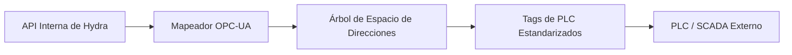

<p align="center">
  
</p>

# 🏭 HYDRA-UMC-OPCUA-SERVER

<p align="center"><a href="README.md">🇺🇸 English</a> | 🇪🇸 <b>Español</b> | <a href="README_fra.md">🇫🇷 Français</a> | <a href="README_ita.md">🇮🇹 Italiano</a> | <a href="README_deu.md">🇩🇪 Deutsch</a> | <a href="README_zho.md">🇨🇳 简体中文</a> | <a href="README_jpn.md">🇯🇵 日本語</a></p>

### 🛠️ Mapeo de Objetos HydraState a Espacios de Direcciones OPC-UA Estandarizados

<p align="left">
  
  
  
</p>

---

## 1. 🛠️ VISIÓN GENERAL TÉCNICA

**HYDRA-UMC-OPCUA-SERVER** es el módulo de modelado industrial central para el Gateway. Traduce el HydraState interno y dinámico (JSON) en un espacio de direcciones OPC-UA estructurado y descubrible.

Permite que el software de automatización industrial (como Ignition, Siemens TIA Portal o Rockwell FactoryTalk) explore, lea y escriba en variables robóticas como si fueran tags de PLC estándar.

### Características Clave:
* 🛠️ **Modelado de Información Dinámico:** Genera automáticamente el árbol OPC-UA basado en los robots y herramientas activos.
* 🔄 **Acceso Lectura/Escritura:** Control seguro de articulaciones y efectores robóticos desde clientes PLC.
* 🔖 **Espacio de Nombres Versionado y NodeIds Estables:** Una URI de espacio de nombres real y explícita, y NodeIds de tipo string explícitos - una actualización del espacio de direcciones no puede cambiar silenciosamente la ruta de la que depende un cliente. *(implementado)*
* 🔐 **Autorización de Escritura por Sesión:** Una comprobación real y dinámica que distingue una sesión anónima de una autenticada - no todos los clientes obtienen acceso de escritura por defecto. *(implementado)*
* 📡 **Soporte de Suscripción:** Actualizaciones de datos de alta eficiencia usando mecanismos de publicación-suscripción de OPC-UA.
* 🛡️ **Cifrado:** Soporte completo para políticas de seguridad firmadas y cifradas (Basic256Sha256).

---

## 2. 🔄 FLUJO DEL ESPACIO DE DIRECCIONES OPC-UA



---

## 3. 🧱 ARQUITECTURA Y DECISIONES DE DISEÑO

* **Por qué es hermano, no un submódulo, de HYDRA-UMC-GATEWAY-INDUSTRIAL.** Cada adaptador de protocolo es un proceso desplegable/reiniciable por separado - un problema en la librería cliente de OPC-UA nunca tumba los adaptadores de MQTT o MTConnect que corren junto a él.
* **Por qué un espacio de direcciones OPC-UA, no un simple passthrough REST.** Los clientes OPC-UA (SCADA/históricos) esperan un espacio de direcciones real y navegable con nodos tipados - un passthrough REST plano expondría técnicamente los datos pero anularía el sentido de hablar OPC-UA.
* **Por qué el punto de entrada solo imprime identidad/versión, y termina tras levantar un listener de health-check.** Etapa de andamiaje, mismo motivo que el propio README del padre - una pasarela real es de larga duración por naturaleza, así que probar que el proceso se mantiene en pie es el primer hito real.
* **Cómo encaja en el resto del ecosistema.** Un servicio hermano bajo HYDRA-UMC-GATEWAY-INDUSTRIAL - traduce el propio estado de HYDRA-UMC-SERVER a un espacio de direcciones OPC-UA real.
* **Tests reales a nivel de protocolo, no solo una comprobación de compilación.** `tests/server.test.ts` conecta un `OPCUAClient` real (el propio cliente de node-opcua, la misma librería que usarían UAExpert/Ignition) contra un `OPCUAServer` real por el protocolo binario real en un puerto TCP real - abriendo una sesión, navegando/leyendo `SwarmOnline`/`ActiveRobotCount` por ruta, y confirmando que una escritura emitida por el cliente se refleja tanto en el valor leído de vuelta como en el estado interno del servidor.
* **Por qué NodeIds de tipo string explícitos, no los numéricos auto-asignados de node-opcua.** Un NodeId numérico se asigna por orden de creación - insertar un nuevo DataItem antes de uno existente en el código lo renumeraría silenciosamente, rompiendo cualquier cliente industrial que tuviera el número antiguo hardcodeado. Un NodeId explícito al estilo `s=HydraNode_1.SwarmOnline` nunca puede desplazarse bajo un cliente solo porque el código del espacio de direcciones cambió de forma.
* **Por qué `SpindleTemp` usa `timestamped_get`, no el `get()` más simple que usan las demás variables.** `get()` sella automáticamente cada lectura con la hora actual - adecuado para un valor en vivo, deshonesto para uno que cambia lentamente (un husillo no se recalienta entre sondeos). `timestamped_get` devuelve un `DataValue` real con un `sourceTimestamp` explícito que registra cuándo cambió realmente el valor por última vez, la semántica real en la que se apoya un histórico de OPC-UA.
* **Por qué la autorización de escritura es por sesión (`isUserWritable`), no un flag estático de nivel de acceso.** Un `userAccessLevel` estático no puede distinguir la sesión de un cliente de la de otro - es el mismo para cada conexión. Sobrescribir `isUserWritable(context)` en el nodo variable es el mecanismo propio y documentado de node-opcua para una comprobación que realmente varía por sesión, lo bastante real como para probarlo con dos identidades de cliente real distintas.

---

## 📂 ESTRUCTURA DE DIRECTORIOS

```text
HYDRA-UMC-OPCUA-SERVER/
├── src/         # Código fuente (Node/TypeScript - Modelo, Servidor, Mapeador)
├── tests/       # Suite Vitest - comportamiento de servidor y seguridad
├── build/       # Salida compilada (npm run build)
├── images/      # Medios y diagramas
├── scripts/     # Scripts de utilidad (bump-version.mjs)
├── tools/       # ci_validate.py - validación de manifest/CHANGELOG/docs usada por la CI
└── README.md
```

Servicio de red puro, sin hardware propio - `hardware/`, `firmware/` y
`os/` se omiten según la política de estructura del repositorio.

---

## 🛠️ ENTORNO DE DESARROLLO

### Requisitos
- [Node.js](https://nodejs.org/) (v18 o superior recomendado)
- npm

### Instalación
```bash
npm install
```

### Modo Desarrollo
Ejecuta el servidor OPC-UA directamente con `tsx` (sin bundler):
- **Windows:** doble clic en `dev.bat` o ejecutar `npm run dev`
- **Linux/Mac:** ejecutar `./dev.sh` o `npm run dev`

### Build de Producción
Empaqueta el servidor en un único archivo desplegable con esbuild:
- **Windows:** doble clic en `build.bat` o ejecutar `npm run build`
- **Linux/Mac:** ejecutar `./build.sh` o `npm run build`

Luego arráncalo con:
```bash
npm start
```

El servidor escucha en `0.0.0.0:4840` (el puerto OPC-UA por defecto
registrado en IANA) en el endpoint
`opc.tcp://<host>:4840/HYDRA-UMC-OPCUA-SERVER` - apunta cualquier cliente
OPC-UA (UAExpert, Ignition, Siemens TIA Portal, ...) para explorar el
espacio de direcciones.

### Versionado
Cada `npm run build` real incrementa automáticamente el `version` de
`package.json` (`scripts/bump-version.mjs`, primer paso del script
`build`) - un "cuentakilómetros" en base 10: patch +1 por build, con
acarreo a minor (y de minor a major) al pasar de 9 en vez de llegar nunca
a un segmento de dos dígitos (`0.0.9` -> `0.1.0`, no `0.0.10`).

---

## 🚀 HOJA DE RUTA
* **Fase 1:** Implementación de OPC-UA Pub/Sub para intercambio de datos de alta velocidad y puente de protocolos heredados.
* **Fase 2:** Clúster de Broker MQTT para gestión masiva de dispositivos IoT y alta concurrencia.
* **Fase 3:** Soporte del adaptador MTConnect para integración de maquinaria CNC y PLC multi-vendedor.
* **Fase 4:** Cumplimiento total con la especificación compañera OPC UA Robotics y sincronización con el industrial gateway.

---

## 🔗 Proyectos Relacionados

Este proyecto es parte del ecosistema de robótica HYDRA-UMC del mismo autor (JuanenRac / Electro Hobby 3D). Vale la pena conocerlo, ya que una petición podría en realidad ser sobre alguno de estos en vez de sobre este repositorio.

**Proyecto Padre**
- **[HYDRA-UMC-GATEWAY-INDUSTRIAL](https://github.com/JuanenRac/HYDRA-UMC-GATEWAY-INDUSTRIAL)** — nodo de integración que retransmite a protocolos industriales, con una capa real de lista blanca de comandos/contrapresión; el padre del que este repositorio es un adaptador de protocolo específico, dentro de su propia pasarela industrial.

**Proyectos Hermanos** — los demás adaptadores de protocolo de la propia pasarela industrial de HYDRA-UMC-GATEWAY-INDUSTRIAL
- **[HYDRA-UMC-MQTT-BROKER](https://github.com/JuanenRac/HYDRA-UMC-MQTT-BROKER)** — broker MQTT real con autenticación por cliente opcional y ACL de tópicos.
- **[HYDRA-UMC-MTCONNECT-ADAPTER](https://github.com/JuanenRac/HYDRA-UMC-MTCONNECT-ADAPTER)** — endpoints XML reales `/probe` y `/current` de MTConnect, con salida en modo degradado.

**Directamente Relacionados**
- **[HYDRA-UMC-SERVER](https://github.com/JuanenRac/HYDRA-UMC-SERVER)** — el backend headless real (REST/WebSocket) con el que habla de verdad cada cliente de control — la fuente del estado que expone este adaptador.

**También Forma Parte del Ecosistema**

*Hardware y Plataforma Base*
- **[HYDRA-UMC](https://github.com/JuanenRac/HYDRA-UMC)** — la placa madre física del brazo robótico: host CM5 + coprocesador STM32H745 de doble núcleo, coordinando hasta 8 brazos herramienta por CAN-OTA/SPI-OTA.
- **[HYDRA-UMC-OS](https://github.com/JuanenRac/HYDRA-UMC-OS)** — capa de producto reproducible sobre Raspberry Pi OS para el CM5: agente de solo lectura, config/perfiles validados, aprovisionamiento WiFi de primer contacto.
- **[HYDRA-UMC-SDK](https://github.com/JuanenRac/HYDRA-UMC-SDK)** — el contrato JSON-Schema compartido y la barrera de seguridad contra la que cada bridge valida sus comandos.

*Backend Central y Clientes*
- **[HYDRA-UMC-STUDIO](https://github.com/JuanenRac/HYDRA-UMC-STUDIO)** — panel de control web con visualización 3D multi-robot en tiempo real.
- **[HYDRA-UMC-SUITE](https://github.com/JuanenRac/HYDRA-UMC-SUITE)** — centro de mando de enjambre de escritorio (PySide6) para varios servidores a la vez, empaquetado como ejecutable independiente.
- **[HYDRA-UMC-ANDROID-CONTROL](https://github.com/JuanenRac/HYDRA-UMC-ANDROID-CONTROL)** — app nativa de control para Android con inicio de sesión biométrico y un compañero Wear OS emparejado.
- **[HYDRA-UMC-IOS-CONTROL](https://github.com/JuanenRac/HYDRA-UMC-IOS-CONTROL)** — app de control para iOS/iPadOS (Flutter) con sincronización en tiempo real por WebSocket.
- **[HYDRA-UMC-DSI](https://github.com/JuanenRac/HYDRA-UMC-DSI)** — interfaz táctil nativa para la pantalla táctil DSI de 7" a bordo, embebida en el propio CM5.
- **[HYDRA-UMC-EDITOR-URDF](https://github.com/JuanenRac/HYDRA-UMC-EDITOR-URDF)** — creador/editor gráfico de URDF de escritorio que envía los modelos terminados al propio catálogo de STUDIO.
- **[HYDRA-UMC-BRIDGE-AMR](https://github.com/JuanenRac/HYDRA-UMC-BRIDGE-AMR)** — barrera de coordinación para flotas AGV/AMR mediante un publicador MQTT VDA 5050 real.
- **[HYDRA-UMC-BRIDGE-CNC](https://github.com/JuanenRac/HYDRA-UMC-BRIDGE-CNC)** — coordinador de alto nivel para celdas CNC con acceso real a estado/bytes de control GRBL.
- **[HYDRA-UMC-BRIDGE-DROIDS](https://github.com/JuanenRac/HYDRA-UMC-BRIDGE-DROIDS)** — barrera de coordinación para droides con patas/humanoides, con un emisor de comandos real para Boston Dynamics Spot.
- **[HYDRA-UMC-BRIDGE-LASER](https://github.com/JuanenRac/HYDRA-UMC-BRIDGE-LASER)** — coordinador de seguridad para celdas láser que lee 3 salvaguardas GPIO reales de llave/carcasa/enclavamiento.
- **[HYDRA-UMC-BRIDGE-OPENPNP](https://github.com/JuanenRac/HYDRA-UMC-BRIDGE-OPENPNP)** — coordinador de alto nivel seguro para el flujo de placas de pick-and-place OpenPnP.
- **[HYDRA-UMC-BRIDGE-PRINTER3D](https://github.com/JuanenRac/HYDRA-UMC-BRIDGE-PRINTER3D)** — barrera de coordinación segura para impresoras 3D Moonraker/Klipper, con comandos de trabajo reales y controlados.
- **[HYDRA-UMC-BRIDGE-ROS2](https://github.com/JuanenRac/HYDRA-UMC-BRIDGE-ROS2)** — coordinador de seguridad con un transporte ROS 2 rclpy real, importado de forma perezosa.
- **[HYDRA-UMC-BRIDGE-UAV](https://github.com/JuanenRac/HYDRA-UMC-BRIDGE-UAV)** — barrera de coordinación para UAV equipados con cámara, con un emisor de comandos MAVLink real.

*Plataforma de Herramientas URTC*
- **[URTC](https://github.com/JuanenRac/URTC)** — firmware para la placa física del Universal Robot Tool Controller, más de 25 perfiles de herramienta por bus CAN.
- **[URTC-FLASHER](https://github.com/JuanenRac/URTC-FLASHER)** — herramienta de escritorio con GUI para flashear placas URTC, CAN-OTA más SWD/JTAG de chip completo.
- **[URTC-TESTER](https://github.com/JuanenRac/URTC-TESTER)** — herramienta de escritorio de diagnóstico CAN-bus en vivo para placas URTC, un panel por perfil de herramienta.
- **[URTC-WEB-STUDIO](https://github.com/JuanenRac/URTC-WEB-STUDIO)** — alternativa basada en navegador a URTC-TESTER mediante la Web Serial API, sin instalación local.

*Nodo IA de Visión (Hailo-8)*
- **[HYDRA-UMC-VISION-NODE](https://github.com/JuanenRac/HYDRA-UMC-VISION-NODE)** — nodo de integración para el pipeline de visión Hailo-8, con una comprobación real de disponibilidad de hardware por etapa.
- **[HYDRA-UMC-DETECTION-HEF](https://github.com/JuanenRac/HYDRA-UMC-DETECTION-HEF)** — registro real de modelos compilados con verificación de carga segura por arquitectura Hailo/checksum.
- **[HYDRA-UMC-VISION-STREAMER](https://github.com/JuanenRac/HYDRA-UMC-VISION-STREAMER)** — generador real de pipeline GStreamer + config MediaMTX, con una frontera de integración HailoRT real.
- **[HYDRA-UMC-VISUAL-SERVOING-API](https://github.com/JuanenRac/HYDRA-UMC-VISUAL-SERVOING-API)** — ley de corrección real de Position-Based Visual Servoing, con puerta de seguridad según el estado de zona previo.
- **[HYDRA-UMC-SAFETY-ZONES](https://github.com/JuanenRac/HYDRA-UMC-SAFETY-ZONES)** — comprobación real de invasión de zona y solicitud de E-STOP, con exigencia de vigencia de calibración.

*Nodo IA Cognitivo (Hailo-10)*
- **[HYDRA-UMC-COGNITIVE-NODE](https://github.com/JuanenRac/HYDRA-UMC-COGNITIVE-NODE)** — nodo de integración para el pipeline cognitivo Hailo-10 (orquestación de LLM/VLA/voz).
- **[HYDRA-UMC-VLA-ENGINE](https://github.com/JuanenRac/HYDRA-UMC-VLA-ENGINE)** — codificación/decodificación real de tokens de acción y generación de trayectoria para un modelo Vision-Language-Action.
- **[HYDRA-UMC-VOICE-UI](https://github.com/JuanenRac/HYDRA-UMC-VOICE-UI)** — front-end de voz real (VAD + analizador de intención) con un relé a Watch acotado y con confirmación.
- **[HYDRA-UMC-SEMANTIC-PLANNER](https://github.com/JuanenRac/HYDRA-UMC-SEMANTIC-PLANNER)** — descomposición real de tareas basada en reglas y recuperación semántica de errores sobre códigos de error del MCU.
- **[HYDRA-UMC-DOCS-QA](https://github.com/JuanenRac/HYDRA-UMC-DOCS-QA)** — búsqueda real de documentos TF-IDF (solo librería estándar) sobre los propios documentos Markdown de este ecosistema.

*Orquestación y Enjambre*
- **[HYDRA-UMC-ORCHESTRATOR](https://github.com/JuanenRac/HYDRA-UMC-ORCHESTRATOR)** — nodo de integración con un contrato real de informe de salud gRPC/Protobuf y una máquina de estados de misión.
- **[HYDRA-UMC-JOB-DISPATCHER](https://github.com/JuanenRac/HYDRA-UMC-JOB-DISPATCHER)** — cola de trabajos real basada en prioridad con deduplicación, sobre una API HTTP real.
- **[HYDRA-UMC-NODE-HEALING](https://github.com/JuanenRac/HYDRA-UMC-NODE-HEALING)** — watchdog de salud de flota real basado en gRPC, con reintento/backoff y detección de discrepancia de identidad.
- **[HYDRA-UMC-PATH-PLANNER-3D](https://github.com/JuanenRac/HYDRA-UMC-PATH-PLANNER-3D)** — planificador de rutas 3D real basado en RRT, con validación real de colisión de obstáculos/espacio de trabajo.
- **[HYDRA-UMC-SWARM-SYNC](https://github.com/JuanenRac/HYDRA-UMC-SWARM-SYNC)** — sincronización de estado real mediante CRDT LWW-Element-Map, con pruebas de propiedades para convergencia multi-celda.

*Gemelo Digital y Simulación*
- **[HYDRA-UMC-TWIN](https://github.com/JuanenRac/HYDRA-UMC-TWIN)** — nodo de integración para el motor de gemelo digital, con un contrato real de sincronización por compatibilidad de versión.
- **[HYDRA-UMC-HIL-BRIDGE](https://github.com/JuanenRac/HYDRA-UMC-HIL-BRIDGE)** — enclavamiento de seguridad real hardware-in-the-loop que enruta comandos entre simulación y hardware real.
- **[HYDRA-UMC-PHYSICS-REPLICA](https://github.com/JuanenRac/HYDRA-UMC-PHYSICS-REPLICA)** — cinemática directa real y validación de límites articulares sobre un subconjunto real de URDF.
- **[HYDRA-UMC-SYNTHETIC-DATA-GEN](https://github.com/JuanenRac/HYDRA-UMC-SYNTHETIC-DATA-GEN)** — generador real de escenas 2D procedurales con exportación de anotaciones YOLO/COCO.

*Datos y Analítica*
- **[HYDRA-UMC-DATALAKE](https://github.com/JuanenRac/HYDRA-UMC-DATALAKE)** — almacén de series temporales real respaldado por sqlite3, con una API HTTP real de ingesta/consulta.
- **[HYDRA-UMC-ANOMALY-DETECTOR](https://github.com/JuanenRac/HYDRA-UMC-ANOMALY-DETECTOR)** — detector de anomalías real basado en FFT + línea base estadística, con monitorización de deriva.
- **[HYDRA-UMC-PRODUCTION-REPORTS](https://github.com/JuanenRac/HYDRA-UMC-PRODUCTION-REPORTS)** — cálculo real de OEE/disponibilidad sobre el histórico de DATALAKE, con exportación CSV reproducible.
- **[HYDRA-UMC-TELEMETRY-COLLECTOR](https://github.com/JuanenRac/HYDRA-UMC-TELEMETRY-COLLECTOR)** — pipeline real de ingesta CAN/WebSocket hacia DATALAKE, con deduplicación por secuencia.

*Herramientas Complementarias y Operaciones del Ecosistema*
- **[HYDRA-UMC-DASHBOARD-AI](https://github.com/JuanenRac/HYDRA-UMC-DASHBOARD-AI)** — paneles de Resúmenes Inteligentes y Resaltado de Anomalías sobre DATALAKE/ANOMALY-DETECTOR, con un respaldo estadístico honesto.
- **[HYDRA-UMC-TOOL-CLI](https://github.com/JuanenRac/HYDRA-UMC-TOOL-CLI)** — CLI de flota con un contrato real y estable de códigos de salida, cliente real y en vivo de la propia API de HYDRA-UMC-SERVER.
- **[HYDRA-UMC-WATCH](https://github.com/JuanenRac/HYDRA-UMC-WATCH)** — app compañera de WearOS con alertas hápticas reales y un relé de voz al teléfono emparejado.
- **[URTC-SMART-RACK](https://github.com/JuanenRac/URTC-SMART-RACK)** — firmware para un rack de montaje de placas con decodificación real de ID de herramienta y lógica de precalentamiento Smart Idle.
- **[URTC-VISION-TOOL](https://github.com/JuanenRac/URTC-VISION-TOOL)** — firmware más un compañero de visión real en Python para un cabezal de inspección térmica/RGB.
- **[HYDRA-UMC-UPDATER](https://github.com/JuanenRac/HYDRA-UMC-UPDATER)** — herramienta administrativa de escritorio que descubre, clona y actualiza cada repositorio de este ecosistema.


---

## 📚 Documentación y Comunidad

- **[CONTRIBUTING.md](CONTRIBUTING.md)** — stack tecnológico y pautas de codificación para un pull request.
- **[CODE_OF_CONDUCT.md](CODE_OF_CONDUCT.md)** — los estándares de comportamiento esperados en esta comunidad.
- **[SECURITY.md](SECURITY.md)** — cómo reportar una vulnerabilidad, y las áreas reales de enfoque en seguridad de este proyecto.
- **[SUPPORT.md](SUPPORT.md)** — dónde hacer preguntas y reportar errores.
- **[LICENSE.md](LICENSE.md)** — la licencia propia de este proyecto.

## 👤 AUTOR
**JuanenRac** (Electro Hobby 3D)
📧 electrohobby3d@gmail.com
📺 [youtube.com/@electrohobby3d](https://youtube.com/@electrohobby3d)

## 📜 LICENCIA
GPL-3.0 - Ver archivo LICENSE para más detalles.
